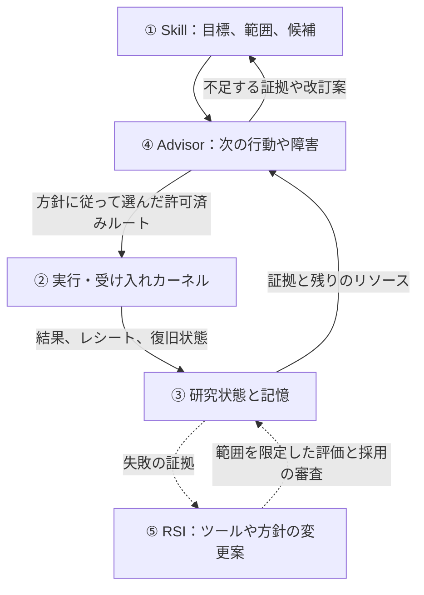

<div align="center">

<picture>
  <source media="(prefers-color-scheme: dark)" srcset=".github/assets/rds-hero-dark.svg">
  
</picture>

# Research Direction Selector

[](https://github.com/kongtou20070406/research-direction-selector/stargazers)
[](https://github.com/kongtou20070406/research-direction-selector/releases)
[](LICENSE)
[](https://github.com/kongtou20070406/research-direction-selector/actions/workflows/test.yml)

**Agent があなたと研究を進め、プログラムが証拠を残す。**

**学術研究のための、証拠に基づく autoresearch。**

Codex、Claude Code などのコーディング Agent と学術研究を進めるためのローカル研究カーネルです。コストの高い実験が複数のセッションにまたがり、入力、失敗の証拠、レシート、残りの予算を保持したいときに使えます。コマンドを包んで実行を記録し、Skill で証拠を検討し、Advisor が管理する研究プロジェクトを設定すれば、許可されたルートから次の一手を選択できます。

[RDS と autoresearch](docs/autoresearch.md) · [CPU のレシートと復旧の例](examples/autoresearch-receipts/README.md) · [ソフトウェアの引用](CITATION.cff)

[English](README.md) · [简体中文](README.zh-CN.md) · **日本語**

</div>

<br />

## なぜ RDS なのか

Agent の作業は高価で確率的で、最適化が困難です。プログラムの作業は安価で決定的で、テストできます。それなのに Agent 主導の研究では、ほとんどすべてを Agent が抱えています。与えられた目標、約束した指標、すでに費用を払った実行、残りの予算、すでに失敗したアイデア。長時間のジョブ、クォータ、セッションの切り替えは、まさにこの記憶が途切れる場所です。

RDS は、判断を必要としない記帳作業をすべて Agent から取り除き、ローカルの追記専用台帳に移します。Agent には、Agent にしかできない仕事が残ります。仮説を立て、何を比較するかを決め、あなたと一緒に証拠を解釈することです。

| RDS がないと、Agent は… | RDS があれば… |
| :--- | :--- |
| 見失った遅いジョブを再起動し、二重に支払う | 同じ登録済み呼び出しは記録済みの実行とレシートを再利用する |
| 結果を見てから指標や閾値を動かす | 指標、閾値、データ、評価器は最初の実行前にハッシュで固定される |
| 終了コード 0 を「成功」と読む | 満たされない目標述語は `FALSE` のまま、欠けた・決着しない根拠は `UNKNOWN` のまま |
| 新しいセッションで、却下済みのルートを再び試す | 台帳はセッションを越えて残り、Advisor は却下済みルートの繰り返しや揺れ動く判断を指摘する |
| 残りの予算を頭の中で管理する | 実時間と CPU の予算はディスパッチ前に予約され、失敗やタイムアウトした試行も計上される |

## 約束ではなく、測定結果

RDS は、正解が既知の合成タスクで実際の Agent を使って検証しており、肯定的な結果も否定的な結果も公開しています。

- **クォータのある高コストな実行。** ローンチ判断タスク（gpt-6-luna、推論強度 medium、クエリ遅延 20 秒と 60 秒で各群 12 試行）では、実験者の計画をプロンプト文として渡された Agent は、6/12 試行で重複クエリによりクォータを浪費し、4/12 試行で誤った判断に至りました。誤った判断はすべて重複クエリの後に起きています。同じ計画を凍結して RDS カーネルが実行した場合、誤りは 0/12、重複クエリは 1/12 でした。その 1 件では、カーネルの実行中に Agent がクエリスクリプトを直接呼び出していました（誤判断の両側 Fisher 検定 p ≈ 0.09、[設計とデータ](https://github.com/kongtou20070406/research-direction-selector/issues/166#issuecomment-5974529436)）。
- **RDS が（まだ）役立たない場面。** 再確認が安価な罠タスクでは、RDS なしの Codex は 3 段階の推論強度、計 80 試行で一度も誤った結論に至りませんでした。そこで RDS は正答率を上げず、レシート、復旧、逸脱の抑止を加えただけで、時間は 20–50% 増えました（[h1–h3 報告](https://github.com/kongtou20070406/research-direction-selector/issues/120#issuecomment-5969647240)）。

いずれも小規模なサンプルで、モデル系列も一つだけです。支持されるのは狭い主張のみです。カーネルの価値は、コストの高い作業を厳密に一度だけ、監査可能な形で実行することにあります。RDS がモデルをより良い科学者にすることは示していません。研究ガイダンスを測定可能な利益に変えることが、[5.9 の計画スレッド](https://github.com/kongtou20070406/research-direction-selector/issues/166)の焦点です。

## 2 分で試す

Git と Python 3.11 以降が必要です。この CPU の例は標準ライブラリだけを使います。

**1. Agent にインストールを頼む。** Codex、Claude Code など、シェルを使える Agent に次を渡してください。

```text
次のリポジトリから Research Direction Selector をインストールしてください。
https://github.com/kongtou20070406/research-direction-selector
research-direction-selector という Agent Skill として扱ってください。
scripts、references、examples を含むリポジトリ全体を保持してください。
このプロジェクトの .agents/skills に配置し、CLI のバージョンを確認してください。
その後 SKILL.md を読み、私の実際の研究課題から始めてください。
```

**2. 同梱の CPU の例を実行する。** プロジェクトのディレクトリから、新しい空の `./rds-demo` を指定して実行します。

```powershell
python -B .agents/skills/research-direction-selector/examples/autoresearch-receipts/run.py --workspace ./rds-demo
```

同梱の合成データに定数と直線を当てはめます。各群を RDS で実行した後、同じ呼び出しを繰り返し、元のレシート、実行数、予算が変わらないことを確認します。画面の結果と `rds-demo/summary.json` には次のフィールドが含まれます。

```json
{
  "results": {
    "control": {"reuse": "EXISTING_JOB"},
    "treatment": {"reuse": "EXISTING_JOB"}
  },
  "scientific_support": "UNKNOWN"
}
```

一部のフィールドだけを抜粋しています。完全なレポートには指標とレシートの識別情報も含まれます。保存される出力は[例のガイド](examples/autoresearch-receipts/README.md)を参照してください。自分のジョブを包む場合は既存のスクリプトに置き換え、[コマンドのラッパー](docs/agent-entry.md#wrap-a-command)に従って入力と出力を宣言してください。

**3. 普段の言葉で頼む。** たとえば次のように伝えられます。

```text
RDS を使って指標の改善が止まった理由を調べてください。既存のログから、学習の問題と容量の限界を区別してください。
複数の要素を同時に変えた二つのアブレーションを RDS で確認し、説明を区別できる最小の公平な比較を設計してください。
RDS でこのプロジェクトを続けてください。次の作業を提案する前に、残りの予算と完了済みの実行を確認してください。
RDS で現在の収縮性の仮説を評価し、対応する形式的命題に検査済みの証拠を生成してください。
```

追加のプロンプトと `[RDS-REJECT]` への対処は[クイックスタート](docs/quickstart.ja-JP.md)にあります。

---

## 研究ループの二つの側面

RDS は Advisor を判断の中心とする研究システムです。二つの側面が協力し、一つの記録済み研究状態を共有します。

**Agent 側** — `research-direction-selector` Skill（`SKILL.md`）は Codex、Claude Code などに、元の目標の明確化、仮説と候補ルートの提案、適用条件の確認、研究者との証拠の解釈を促します。

**プログラム側** — ローカル CLI（`scripts/rds_cli.py`）は対応する行動をソース、入力、リソースに結び付け、実行の准入を検査し、結果とレシートを記録します。凍結した `advisor_policy` があるプロジェクトでは、プログラムが状態を更新し、Advisor が実行前に次の許可済みルートを選びます。

ループは **目標と制約 → Advisor の判断 → 制約下での実行 → 結果とレシート → 研究状態の更新 → Advisor** です。記録は `.rds/` に保存します。`references/judgment-graph.yaml` は適用範囲を持つ方法論ルールを提供します。

最新の安定リリースは [5.8.0](https://github.com/kongtou20070406/research-direction-selector/releases/tag/v5.8.0) です。開発 checkout のバージョン表記は `5.9.0-rc.2` で、公開は保留中です。範囲は[プレビュー説明](docs/releases/5.9.0-rc.2-preview.md)、研究能力の主張に関する検証は[評価計画](https://github.com/kongtou20070406/research-direction-selector/issues/166)を参照してください。

---

## 5 つの主要機能コンポーネント

五つのコンポーネントが、一つの記録済み研究状態を共有します。

| コンポーネント | 主な役割 | 答える問い |
| :--- | :--- | :--- |
| **① 研究プロトコル：Skill** | 目標の理解、仮説、対照、次の一歩を導く | **研究をどう考え、進めるか？** |
| **② 実行・受け入れカーネル** | 実験状態、実行、結果、予算、証拠を管理する | **どう実行し、どの事前条件を満たしたか？** |
| **③ 研究状態と記憶** | 目標、設定、結果、失敗、判断の根拠を保持する | **何を行い、何が分かり、なぜここに至ったか？** |
| **④ Advisor エンジン** | 元の目標、証拠、制約、候補から次の行動や障害を示す | **次に何を実行でき、何の証拠で判断が変わるか？** |
| **⑤ 自己改善モジュール：RSI** | ルールや方針の変更を提案し、採用前に評価する | **RDS 自身のどの判断や実践を改善するか？** |



Skill は Agent の研究上の推論を導き、Advisor は記録された証拠から次のルートを提案または選択し、RSI は RDS 自身のルール、ツール、方針の変更を評価します。入力と証拠の範囲は[研究ワークフロー](docs/research-workflow.md)、能力レベルと今後の検証が必要な主張は[自律性の範囲](docs/research-autonomy.md)を参照してください。

---

## Skill：Agent を入口とする研究支援

Skill は Agent が読む部分です。いつカーネルを呼ぶか、公平な比較をどう述べるか、`UNKNOWN` を成功に格上げせずに結果をどう報告するかを Agent に示します。

Skill を読み込んだホスト Agent は、研究の開始時や、証拠・説明・方向・資源の制約が次の判断を変えるときに、短い対話を自ら始めます。現在の判断を説明し、有用な次の一手を勧め、答えが作業を変える場合に的を絞った質問をします。許可済みの作業は継続し、毎回の質問や確認は必要ありません。

「この結果を見ると、元の説明に疑問があります」「新しい実験を止め、まず対照が公平か確認してください」のように話せます。Agent は証拠を議論し、指示が実際に何へ影響したかを説明します。CLI は確認可能な記録を提供し、対話はホスト Agent が担います。詳しくは[計画と方向変更](docs/planning-and-steering.md#host-initiated-research-discussion)を参照してください。これは Skill の行動指針であり、対話の質と科学的な利益には実際の Agent による評価が必要です。

### インストール

推奨する Agent によるインストールは[2 分で試す](#2-分で試す)を参照してください。Claude Code・Codex プラグインと、短い呼び出し状態を表示する OMP 拡張は[ホスト別プラグインの手順](docs/host-plugins.md)を参照してください。従来の単独 Skill インストールも引き続き利用できます。

#### 手動インストール

上の例と同じプロジェクト内の配置にする場合、プロジェクトのディレクトリから実行します。

```powershell
New-Item -ItemType Directory -Path .agents/skills -Force | Out-Null
git clone https://github.com/kongtou20070406/research-direction-selector.git .agents/skills/research-direction-selector
python -B .agents/skills/research-direction-selector/scripts/rds_cli.py --version
```

複数のプロジェクトで共有する場合は、ユーザーディレクトリに配置します。

```powershell
New-Item -ItemType Directory -Path "$env:USERPROFILE/.agents/skills" -Force | Out-Null
git clone https://github.com/kongtou20070406/research-direction-selector.git "$env:USERPROFILE/.agents/skills/research-direction-selector"
python -B "$env:USERPROFILE/.agents/skills/research-direction-selector/scripts/rds_cli.py" --version
```

ユーザーディレクトリに配置した場合は、引用符で囲んだインストール先のパスでデモを実行します。

```powershell
python -B "$env:USERPROFILE/.agents/skills/research-direction-selector/examples/autoresearch-receipts/run.py" --workspace ./rds-demo
```

作業ディレクトリは自分のプロジェクトに保ち、そのルートを CLI に渡します。この後の `scripts/` または `examples/` で始まるコマンドはリポジトリのルートを前提とします。インストール後のパスの解決方法は[入口ガイド](docs/agent-entry.md)を参照してください。既存のインストール先は内容を確認してから更新してください。

---

## 決定的な実行・受け入れカーネル

カーネル（`scripts/rds_cli.py`）は Python 3.11 以降の標準ライブラリで動作します。`exec` は一つのコマンドを記録し、プロジェクト契約は事前登録した比較を固定します。同じ登録済み呼び出しは元の実行を再利用します。RDS の外で発行するコマンドはその制御範囲外です。

リポジトリのルートから、新しい空の `./my-project` ディレクトリを使って、以下の CPU デモを実行してください。準備ステップは、対照群と処置群の両方について、実ファイルに結び付いた契約とマニフェストを作成します。このデモは科学的な確認を示すものではありません。実行とレシートの詳細は[プロジェクト実行器の例](examples/project-runner/README.md)を参照してください。

```powershell
# 0. 例の契約、データ、マニフェストを準備
python -B examples/project-runner/prepare.py --root ./my-project

# 1. 契約から研究状態を初期化
python -B scripts/rds_cli.py --root ./my-project project init --mode quick --contract ./my-project/contract.json

# 2. トランザクションによる予算管理のもとで両群を作成・実行
python -B scripts/rds_cli.py --root ./my-project project create --manifest ./my-project/control.json
python -B scripts/rds_cli.py --root ./my-project project execute --id control
python -B scripts/rds_cli.py --root ./my-project project create --manifest ./my-project/treatment.json
python -B scripts/rds_cli.py --root ./my-project project execute --id treatment

# 3. コストと状態を確認
python -B scripts/rds_cli.py --root ./my-project project costs
python -B scripts/rds_cli.py --root ./my-project project status
```

この `advisor_policy` のない例では、カーネルは記録済み状態から手順上の次の一手を導出します。
`python -B scripts/rds_cli.py --root ./my-project project next` で、登録・実行・復旧・比較・判断の記録のうち、次の一つと実行コマンドを確認できます。

CLI の呼び出しは既定でローカルに記録します。`python -B scripts/rds_cli.py usage --days 7` で日ごとの回数を、`usage --since 2026-09-01 --until 2026-10-01` で期間を指定できます。`--json` は構造化した件数を返します。記録範囲と保存先は[CLI の利用記録](docs/cli-usage.md)を参照してください。

---

## Lean4 スタイルの宣言型形式検証

`scripts/rds_verify.py` は宣言された数学的命題を検査し、状態、保証の分類、利用可能な証明書を返します。以下の対応分野で使えます。より広い主張には、その主張に対応する検証器や証明が必要です。範囲を限定したタクティックのインターフェースは Lean スタイルのワークフローに着想を得ています。

- **対応する命題** — 有理数関係、アフィン力学、範囲を限定した行列スペクトルの界、対応する Linear/ReLU の性質、具体的なテンソル、正確な単位円板の被覆、登録済みのネイティブ Lean 証明義務を検査します。有限の定理モジュールで対応する命題を組み合わせられます。ルールと保証の分類は[形式検証のリファレンス](docs/formal-verification.md)を参照してください。方法論の助言には別の判断グラフを使います。
- **範囲を限定したタクティックのディスパッチャー** — `LeanFormalEngine().verify(spec, tactics)` は `rule`、`gershgorin`、`spectral_radius`、`scale_invariance`、`interval`、`lean4` を受け付けます。タクティックは互換性のある登録済み検査を選び、未対応または結論を出せない入力には `UNKNOWN` を返します。
- **ネイティブ Lean 4 アダプター** — ネイティブ Lean 実行ファイルを設定すると、固定テンプレートの閉じた有理数の `eq`、`lt`、`le` 証明義務は、ネイティブ再検査と公理が空であることの監査後に `LEAN_KERNEL_CHECKED` を受け取ります。任意の Lean ソースやユーザーのタクティックは受け付けません。

リポジトリのルートから同梱の命題を検証し、生成した証明書を再検査します。

```powershell
python -B scripts/rds_cli.py --root . formal verify --spec examples/formal/theorem_module.json --output proof.json --no-cache
python -B scripts/rds_cli.py --root . formal check --spec examples/formal/theorem_module.json --certificate proof.json
```

検査済みの数学的命題だけでは、タスク性能、因果的な切り分け、実際に実行された学習グラフとの対応は示せません。スキーマ、保証レベルのラベル、対応範囲は[形式検証](docs/formal-verification.md)を参照してください。

---

## Advisor：証拠に基づく提案

[プログラムが管理する研究プロジェクト](docs/program-owned-advisor.md)では、目標述語、許可されたルート、結果の読み取り方法を凍結します。`project advance` はプログラムが選んだ一つのルートを実行し、レシートを確定し、宣言した出力を証拠グラフへ取り込んで次の Advisor レポートを返します。収集の復旧では、完了済み実験の結果を再利用します。`advisor_policy` がないプロジェクトは呼び出し側がルートを指定します。

[範囲を限定した研究ループ](docs/autonomy-loop.md)の `project drive` は、台帳に基づく選択、障害後のモデルによる方法・ツール提案、検証済みの変更採用、元の研究への継続を接続します。元の予算と失敗の証拠は保持します。[領域確認](docs/domain-confirmation.md)は数学の正確な証明書、有限の整数アルゴリズム事例、CPU テンソル指標を実行成功と区別して検査します。汎用の科学的自律性や独立した研究効果を保証するものではありません。

Advisor は元の目標、現在の事実、制約を候補ルートに結び付けます。Agent は新しい仮説を提示し、適用条件と領域固有の検証器を確認します。宣言済みの RDS 入口を制御しますが、RDS の外で発行するコマンドはその範囲外です。

`scripts/rds_advisor.py` は記録された証拠と方法論グラフから、次の手順を提案します。
- **診断の前に証拠を確認** — 単一の loss 値では過学習や学習不足の診断を支えられません。対になった曲線や比較可能な観測が、説明候補の背景を与えます。
- **介入の前に発生箇所を特定** — NaN/Inf に対しては、数値的な保護策を変える前に、最初の非有限値を特定し、精度や更新経路を確認する提案を優先します。
- **ループ履歴の確認** — 記録されたチェックポイントにより、Advisor は以前に却下したルートの繰り返し、再び開かれたレビュー、同じ選択肢の間で揺れ動く判断を指摘できます。
- **グラフに基づく候補** — 方法論ルールが診断の手がかりと探索候補を整理します。その順位付けは、因果効果、パレート最適性、実験がすべてのルール義務を満たすことを証明しません。

```powershell
python -B scripts/rds_cli.py --root ./my-project advise
```

実行の成功、目標述語の成立、科学的な裏付けは別の結果です。指標が閾値を超えても科学的根拠は `UNKNOWN` のままであり得ます。科学的判断や RSI 方針の改善には、未使用の課題、同じ総予算、失敗と評価コストを含む公平な事前比較が必要です。現時点の結果は[測定結果](#約束ではなく測定結果)を参照してください。

---

## Obelisk 履歴との連携

推奨する任意の記憶拡張：[Obelisk](https://github.com/tommy0103/obelisk)。軽量な決定グラフは研究の堂々巡りを防ぎ、過去のセッションの正確な情報が必要なときは Obelisk を使います。履歴ストアを重複して構築する必要はありません。

```powershell
python -B scripts/rds_cli.py history prepare --project-path 'C:\research\project' --terms 'C7' --output 'C:\queries\obq-c7-unique-token.mjs'
python -B scripts/rds_cli.py history query --query 'C:\queries\obq-c7-unique-token.mjs'
```

---

## 検証とテスト

回帰テスト、追加の形式検証依存関係、開発時の検査は[貢献ガイド](CONTRIBUTING.md#performance-and-final-acceptance)を参照してください。履歴のリプレイとレッドチーム検査の範囲は[ベンチマークのガイド](benchmark/README.md)にあります。

---

## リポジトリ構成

```text
SKILL.md                         Agent の協働プロトコル（コンポーネント ①）
scripts/rds_cli.py               実行カーネルとトランザクション予算台帳（コンポーネント ②）
scripts/rds_probe.py             制限された AST とスカラーの形式的受け入れ検査（コンポーネント ②）
scripts/rds_verify.py            宣言型ルール、限定タクティック、証明書検査（コンポーネント ②）
scripts/rds_compress.py          テレメトリログ圧縮とスパイク監視（コンポーネント ②）
references/judgment-graph.yaml   方法論判断グラフ（コンポーネント ③）
references/                      状態機械の契約と RSI の証拠（コンポーネント ③）
scripts/rds_obelisk.py           Obelisk セッション履歴ブリッジ（コンポーネント ③）
scripts/rds_advisor.py           証拠に基づく Advisor エンジン（コンポーネント ④）
scripts/rds_meta.py              RSI のルール振り返りとグラフ変更（コンポーネント ⑤）
scripts/rds_adversary.py         RSI の対抗的な変種と評価候補（コンポーネント ⑤）
benchmark/                       過去の判断パケットとレッドチームベンチマーク
tests/                           全回帰テストスイート
```

---

## 参加する

RDS はオープンに開発されています。いま最も役立つ貢献はコードだけではありません。

- **Agent がつまずくタスク。** RDS なしの Agent が誤った結論に至る合成タスクは、新機能よりも価値があります。ベンチマークのフィクスチャ、採点器、Agent 試行のレポートを歓迎します（[#169](https://github.com/kongtou20070406/research-direction-selector/issues/169)）。
- **あなたの研究ワークフロー。** Agent が実行、予算、却下したアイデアをどこで見失うかを教えてください。実際の失敗パターンがロードマップを形づくります。
- **ホストとアダプター。** より多くの Agent ホスト向けプラグイン、実行バックエンド、形式検証アダプター。
- **翻訳とドキュメント。** README は英語・中国語・日本語で提供しています。修正を歓迎します。

[コントリビューションガイド](CONTRIBUTING.md)から始めるか、[オープンな issue](https://github.com/kongtou20070406/research-direction-selector/issues) を見るか、あなたの研究課題を書いた issue を立ててください。

---

## Star の推移

<a href="https://www.star-history.com/#kongtou20070406/research-direction-selector&Date">
  <picture>
    <source media="(prefers-color-scheme: dark)" srcset="https://api.star-history.com/svg?repos=kongtou20070406/research-direction-selector&type=Date&theme=dark">
    
  </picture>
</a>

このチャートは公開の Star History サービスから読み込まれ、GitHub star の推移のみを反映します。研究上の意味はありません。

---

## ライセンス

Apache License 2.0。詳細は [LICENSE](LICENSE) を参照してください。
