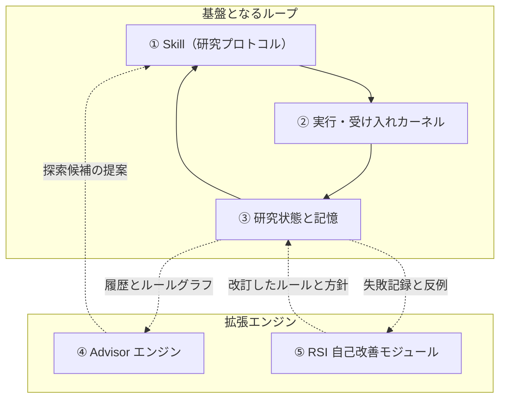

<div align="center">

<picture>
  <source media="(prefers-color-scheme: dark)" srcset=".github/assets/rds-hero-dark.svg">
  
</picture>

# Research Direction Selector

[](https://github.com/kongtou20070406/research-direction-selector/stargazers)
[](https://github.com/kongtou20070406/research-direction-selector/releases)
[](LICENSE)
[](https://github.com/kongtou20070406/research-direction-selector/actions/workflows/test.yml)

**Agent が提案し、プログラムが帳簿をつける。**

Codex、Claude Code などのコーディング Agent のためのローカル研究カーネルです。実験が何を示すべきかを事前に凍結し、コストの高いジョブを一度だけ実行し、Agent が書き換えられないレシートを残し、すでに失敗したことを覚えています。次の一手は、コンテキストウィンドウの記憶ではなく、記録された証拠から決まります。

[English](README.md) · [简体中文](README.zh-CN.md) · **日本語**

</div>

<br />

## なぜ RDS なのか

Agent の作業は高価で確率的で、最適化が困難です。プログラムの作業は安価で決定的で、テストできます。それなのに Agent 主導の研究では、ほとんどすべてを Agent が抱えています。与えられた目標、約束した指標、すでに費用を払った実行、残りの予算、すでに失敗したアイデア。長時間のジョブ、クォータ、セッションの切り替えは、まさにこの記憶が途切れる場所です。

RDS は、判断を必要としない記帳作業をすべて Agent から取り除き、ローカルの追記専用台帳に移します。Agent には、Agent にしかできない仕事が残ります。仮説を立て、何を比較するかを決め、あなたと一緒に証拠を解釈することです。

| RDS がないと、Agent は… | RDS があれば… |
| :--- | :--- |
| 見失った遅いジョブを再起動し、二重に支払う | 登録済みの実行は一度だけ実行され、同一の呼び出しには既存のレシートが返る |
| 結果を見てから指標や閾値を動かす | 指標、閾値、データ、評価器は最初の実行前にハッシュで固定される |
| 終了コード 0 を「成功」と読む | 満たされない目標述語は `FALSE` のまま、欠けた・決着しない根拠は `UNKNOWN` のまま |
| 新しいセッションで、却下済みのルートを再び試す | 台帳はセッションを越えて残り、Advisor は却下済みルートの繰り返しや揺れ動く判断を指摘する |
| 残りの予算を頭の中で管理する | 実時間と CPU の予算はディスパッチ前に予約され、失敗やタイムアウトした試行も計上される |

## 約束ではなく、測定結果

RDS は、正解が既知の合成タスクで実際の Agent を使って検証しており、肯定的な結果も否定的な結果も公開しています。

- **クォータのある高コストな実行。** ローンチ判断タスク（gpt-6-luna、推論強度 medium、クエリ遅延 20 秒と 60 秒で各群 12 試行）では、実験者の計画をプロンプト文として渡された Agent は、6/12 試行で重複クエリによりクォータを浪費し、4/12 試行で誤った判断に至りました。誤った判断はすべて重複クエリの後に起きています。同じ計画を凍結して RDS カーネルが実行した場合、誤りは 0/12、重複クエリは 1/12 でした。その 1 件では、カーネルの実行中に Agent がクエリスクリプトを直接呼び出していました（誤判断の両側 Fisher 検定 p ≈ 0.09、[設計とデータ](https://github.com/kongtou20070406/research-direction-selector/issues/166#issuecomment-5974529436)）。
- **RDS が（まだ）役立たない場面。** 再確認が安価な罠タスクでは、RDS なしの Codex は 3 段階の推論強度、計 80 試行で一度も誤った結論に至りませんでした。そこで RDS は正答率を上げず、レシート、復旧、逸脱の抑止を加えただけで、時間は 20–50% 増えました（[h1–h3 報告](https://github.com/kongtou20070406/research-direction-selector/issues/120#issuecomment-5969647240)）。

いずれも小規模なサンプルで、モデル系列も一つだけです。支持されるのは狭い主張のみです。カーネルの価値は、コストの高い作業を厳密に一度だけ、監査可能な形で実行することにあります。RDS がモデルをより良い科学者にすることは示していません。研究ガイダンスを測定可能な利益に変えることが、[5.9 の計画スレッド](https://github.com/kongtou20070406/research-direction-selector/issues/166)の焦点です。

## 2 分で試す

**1. Agent にインストールしてもらう。** 端末にアクセスできる Codex、Claude Code、その他の Agent に次を渡してください。

```text
次のリポジトリから Research Direction Selector をインストールしてください。
https://github.com/kongtou20070406/research-direction-selector
research-direction-selector Agent Skill として配置してください。
scripts、references、examples を含むリポジトリ全体を保持してください。
現在のプロジェクトの .agents/skills ディレクトリを使い、CLI のバージョンを確認してください。
その後 SKILL.md を読み、私の実際の研究課題から協働を始めてください。
```

**2. コストの高いコマンドを一つ包む。** 契約や JSON は不要です。プロジェクトのディレクトリで実行します（Python 3.11+、標準ライブラリのみ）。

```powershell
python -B .agents/skills/research-direction-selector/scripts/rds_cli.py --root . exec --name train-001 -t 600 -o outputs/result.json train.py
```

RDS は入力を凍結したジョブディレクトリにコピーし、時間上限を予約し、ジョブを実行して `.rds/` にレシートを記録します。同じコマンドをもう一度実行すると、二度目の支払いをせずに `EXISTING_JOB` を返します。バインディング、出力、制約は[コマンドのラップ](docs/agent-entry.md#wrap-a-command)を参照してください。

**3. 普段の言葉で依頼する。** 例えば次のように使えます。

```text
RDS を使って、指標が改善しなくなった理由を調べてください。既存のログから学習の問題と容量の限界を区別してください。
RDS を使って、複数の要素を同時に変えた二つのアブレーションを検討してください。異なる説明を区別できる最小の公平な比較を設計してください。
RDS を使って、このプロジェクトを続けてください。新しい作業を提案する前に、残りの予算と完了した実行を確認してください。
RDS を使って、現在の収縮性の仮説を評価し、対応する形式的な命題について検査済みの証拠を生成してください。
```

コピーして使えるプロンプトや `[RDS-REJECT]` が出たときの対処は、[クイックスタート](docs/quickstart.ja-JP.md)を参照してください。

---

## 研究ループの二つの側面

RDS の二つの側面は、同じ研究状態を共有します。

**Agent 側** — `research-direction-selector` Agent Skill（`SKILL.md`）は、コーディング Agent（Codex、Claude Code など）に、研究目標の理解、反証可能な仮説の設定、公平な対照の設計、ゲートのフィードバックを構造化した次の計画に変える方法を教えます。Agent は自然言語で対話し、実験を計画します。

**カーネル側** — ローカル参照エンジン（`scripts/rds_cli.py`）は、トランザクションで管理する SQLite 予算、AST と範囲を限定した宣言型の形式ゲート、ベースラインのキャッシュ、テレメトリの圧縮、証拠に基づく Advisor を管理します。

両者は同じ `.rds/` 状態ストアと `references/judgment-graph.yaml` の因果ルールを読み書きします。

---

## 5 つの主要機能コンポーネント

責務ごとに整理すると、RDS は **5 つの主要コンポーネント**で構成されます。基盤となる 3 つと、機能を拡張する 2 つです。

| 主要コンポーネント | 主な責務 | 答える問い |
| :--- | :--- | :--- |
| **① 研究プロトコル：Skill** | Agent に目標の理解、仮説の設定、対照の設計、次の計画を導く | **この研究をどう考え、進めるべきか？** |
| **② 実行・受け入れカーネル** | 実験状態の管理、実行ツールの呼び出し、結果の収集、予算と証拠の検査 | **実験をどう実行するか？結果は事前に定めたどの条件を満たすか？** |
| **③ 研究状態と記憶** | 目標、設定、結果、失敗条件、判断の証拠をセッションをまたいで保持する | **何を実施し、何がわかり、なぜこの地点に至ったか？** |
| **④ Advisor エンジン** | 観測、履歴、ルールから診断の手がかりと行動候補を提案する | **現在の状況で、次に何を試せるか？** |
| **⑤ 自己改善モジュール：RSI** | ルールや方針の変更を提案し、採用前に評価する | **RDS 自身のどの判断や実践を改善すべきか？** |



### 混同しやすい三つの関係

- **Skill と Advisor：** Skill は公平な対照や指標と機構の区別など、研究の実践を定めます。Advisor は、学習が十分か確認する、別の候補を試すなど、現在の状況に応じた行動を提案します。
- **記憶と Advisor：** 記憶は何が起きたかとその証拠を保持します。Advisor はその記録を使い、次に何を確認する価値があるかを提案します。
- **Advisor と RSI：** Advisor は研究対象のモデルや実験の改善を支援します。RSI は **RDS 自身のルールと判断方針**の改善を試みます。

### その他の名称はどこに属するか？

- **予算管理、ベースラインのキャッシュ、ログ抽出、プローブ、形式検査**は、主に **② 実行・受け入れカーネル**の内部モジュールに属します。
- **`.rds/` のプロジェクト記録、Obelisk の履歴インターフェース、判断グラフ（`judgment-graph.yaml`）**は、主に **③ 研究状態と記憶**に属し、他のコンポーネントから参照されます。
- **L1–L5** は研究フレームワークで議論する[能力レベル](docs/research-autonomy.md)であり、追加のコンポーネントではありません。

**最初の 3 つが基本的な研究ループを支え、Advisor は能動的な提案を、RSI はツール自体の改善を加えます。** システムは **基盤 3 つ + 拡張 2 つ、計 5 つのコンポーネント**で構成されます。

---

## Skill：Agent を入口とする研究支援

Skill は Agent が読む部分です。いつカーネルを呼ぶか、公平な比較をどう述べるか、`UNKNOWN` を成功に格上げせずに結果をどう報告するかを Agent に示します。

### インストール

推奨する Agent によるインストールは[2 分で試す](#2-分で試す)を参照してください。Claude Code・Codex プラグインと、短い呼び出し状態を表示する OMP 拡張は[ホスト別プラグインの手順](docs/host-plugins.md)を参照してください。従来の単独 Skill インストールも引き続き利用できます。

#### 手動インストール

```powershell
New-Item -ItemType Directory -Path "$env:USERPROFILE/.agents/skills" -Force | Out-Null
git clone https://github.com/kongtou20070406/research-direction-selector.git "$env:USERPROFILE/.agents/skills/research-direction-selector"
```

---

## 決定的な実行・受け入れカーネル

カーネル（`scripts/rds_cli.py`）は Python 3.11+ の標準ライブラリのみで動作します。単一のコマンドは `exec` で包み、事前登録した比較が必要なときはプロジェクト契約を使います。

リポジトリのルートから、新しい空の `./my-project` ディレクトリを使って、以下の CPU デモを実行してください。準備ステップは、対照群と処置群の両方について、実ファイルに結び付いた契約とマニフェストを作成します。このデモは科学的な確認を示すものではありません。実行とレシートの詳細は[プロジェクト実行器の例](examples/project-runner/README.md)を参照してください。

```powershell
# 0. 例の契約、データ、マニフェストを準備
python -B examples/project-runner/prepare.py --root ./my-project

# 1. 契約から研究状態を初期化
python -B scripts/rds_cli.py --root ./my-project project init --mode quick --contract ./my-project/contract.json

# 2. トランザクションによる予算管理のもとで両群を作成・実行
python -B scripts/rds_cli.py --root ./my-project project create --manifest ./my-project/control.json
python -B scripts/rds_cli.py --root ./my-project project execute --id control
python -B scripts/rds_cli.py --root ./my-project project create --manifest ./my-project/treatment.json
python -B scripts/rds_cli.py --root ./my-project project execute --id treatment

# 3. コストと状態を確認
python -B scripts/rds_cli.py --root ./my-project project costs
python -B scripts/rds_cli.py --root ./my-project project status
```

カーネルは記録された台帳状態からキャンペーンの次の一手を導出します。いつでも
`python -B scripts/rds_cli.py --root ./my-project project next` を実行すると、
今すべき一つのアクション（登録・実行・復旧・比較・決定の記録）とその実行可能な
コマンドが出力されます。エージェントはこの手順を繰り返すだけでループ全体を
推進でき、上のコマンド列を暗記する必要はありません。

---

## Lean4 スタイルの宣言型形式検証

[範囲を限定した研究ループ](docs/autonomy-loop.md)の `project drive` は、台帳に基づく選択、障害後のモデルによる方法・ツール提案、検証済みの変更採用、元の研究への継続を接続します。元の予算と失敗の証拠は保持します。[領域確認](docs/domain-confirmation.md)は数学の正確な証明書、有限の整数アルゴリズム事例、CPU テンソル指標を実行成功と区別して検査します。汎用の科学的自律性や独立した研究効果を保証するものではありません。

`scripts/rds_verify.py` は、有限の宣言的命題、登録済みの領域ルール、独立した証明書検査を提供します。範囲を限定したタクティックインターフェースは Lean スタイルの証明ワークフローに着想を得ています。汎用の Lean や Mathlib の証明器ではありません。

- **信頼するルールの登録簿** — 有理数スカラーの閾値、アフィン力学、適用範囲を定めた行列スペクトル検査、対応する Linear/ReLU の性質、具体的なテンソル、正確な単位円板の幾何被覆、ネイティブ Lean の証明義務（閉じた有理数関係と範囲を限定した統計義務）を扱う 15 個の原子的数学ルールを登録しています。有限の定理モジュールはこれらの命題を組み合わせます。この登録簿は、23 ノードの方法論判断グラフとは別です。
- **範囲を限定したタクティックのディスパッチャー** — `LeanFormalEngine().verify(spec, tactics)` は `rule`、`gershgorin`、`spectral_radius`、`scale_invariance`、`interval`、`lean4` を受け付けます。タクティックは互換性のある登録済み検査を選び、未対応または結論を出せない入力には `UNKNOWN` を返します。
- **ネイティブ Lean 4 アダプター** — ネイティブ Lean 実行ファイルを設定すると、固定テンプレートの閉じた有理数の `eq`、`lt`、`le` 証明義務は、ネイティブ再検査と公理が空であることの監査後に `LEAN_KERNEL_CHECKED` を受け取ります。任意の Lean ソースやユーザーのタクティックは受け付けません。

リポジトリのルートから、次の Python 例を実行してください。

```python
import json
import sys
from pathlib import Path

sys.path.insert(0, "scripts")
from rds_verify import LeanFormalEngine, check_certificate

spec = json.loads(Path("examples/formal/theorem_module.json").read_text(encoding="utf-8"))
result = LeanFormalEngine().verify(spec, tactics=("rule",))
assert result["status"] == "PASS"
assert result["assurance"] == "CERTIFICATE_CHECKED"
assert check_certificate(spec, result["certificate"])
```

同じ宣言を CLI から検証することもできます。

```powershell
python -B scripts/rds_cli.py --root . formal verify --spec examples/formal/theorem_module.json --output proof.json --no-cache
python -B scripts/rds_cli.py --root . formal check --spec examples/formal/theorem_module.json --certificate proof.json
```

検査済みの数学的命題だけでは、タスク性能、因果的な切り分け、実際に実行された学習グラフとの対応は示せません。スキーマ、保証レベルのラベル、対応範囲は[形式検証](docs/formal-verification.md)を参照してください。

---

## Advisor：証拠に基づく提案

`scripts/rds_advisor.py` は記録された証拠と方法論グラフから、次の手順を提案します。
- **診断の前に証拠を確認** — 単一の loss 値では過学習や学習不足の診断を支えられません。対になった曲線や比較可能な観測が、説明候補の背景を与えます。
- **介入の前に発生箇所を特定** — NaN/Inf に対しては、数値的な保護策を変える前に、最初の非有限値を特定し、精度や更新経路を確認する提案を優先します。
- **ループ履歴の確認** — 記録されたチェックポイントにより、Advisor は以前に却下したルートの繰り返し、再び開かれたレビュー、同じ選択肢の間で揺れ動く判断を指摘できます。
- **グラフに基づく候補** — 方法論ルールが診断の手がかりと探索候補を整理します。その順位付けは、因果効果、パレート最適性、実験がすべてのルール義務を満たすことを証明しません。

```powershell
python -B scripts/rds_cli.py --root ./my-project advise
```

---

## Obelisk 履歴との連携

推奨する任意の記憶拡張：[Obelisk](https://github.com/tommy0103/obelisk)。軽量な決定グラフは研究の堂々巡りを防ぎ、過去のセッションの正確な情報が必要なときは Obelisk を使います。履歴ストアを重複して構築する必要はありません。

```powershell
python -B scripts/rds_cli.py history prepare --project-path 'C:\research\project' --terms 'C7' --output 'C:\queries\obq-c7-unique-token.mjs'
python -B scripts/rds_cli.py history query --query 'C:\queries\obq-c7-unique-token.mjs'
```

---

## 検証とテスト

```powershell
# 全テストスイートを実行
python -m unittest discover -s tests -p "test_*.py" -v

# 過去のケースをリプレイ
python benchmark/run.py

# 対抗的なレッドチームのストレステストを実行
python benchmark/redteam/runner.py
```

---

## リポジトリ構成

```text
SKILL.md                         Agent の協働プロトコル（コンポーネント ①）
scripts/rds_cli.py               実行カーネルとトランザクション予算台帳（コンポーネント ②）
scripts/rds_probe.py             制限された AST とスカラーの形式的受け入れ検査（コンポーネント ②）
scripts/rds_verify.py            宣言型ルール、限定タクティック、証明書検査（コンポーネント ②）
scripts/rds_compress.py          テレメトリログ圧縮とスパイク監視（コンポーネント ②）
references/judgment-graph.yaml   23 ノードの方法論判断グラフ（コンポーネント ③）
references/                      状態機械の契約と RSI の証拠（コンポーネント ③）
scripts/rds_obelisk.py           Obelisk セッション履歴ブリッジ（コンポーネント ③）
scripts/rds_advisor.py           証拠に基づく Advisor エンジン（コンポーネント ④）
scripts/rds_meta.py              RSI のルール振り返りとグラフ変更（コンポーネント ⑤）
scripts/rds_adversary.py         RSI の対抗的な変種と評価候補（コンポーネント ⑤）
benchmark/                       過去の判断パケットとレッドチームベンチマーク
tests/                           全回帰テストスイート
```

---

## 参加する

RDS はオープンに開発されています。いま最も役立つ貢献はコードだけではありません。

- **Agent がつまずくタスク。** RDS なしの Agent が誤った結論に至る合成タスクは、新機能よりも価値があります。ベンチマークのフィクスチャ、採点器、Agent 試行のレポートを歓迎します（[#169](https://github.com/kongtou20070406/research-direction-selector/issues/169)）。
- **あなたの研究ワークフロー。** Agent が実行、予算、却下したアイデアをどこで見失うかを教えてください。実際の失敗パターンがロードマップを形づくります。
- **ホストとアダプター。** より多くの Agent ホスト向けプラグイン、実行バックエンド、形式検証アダプター。
- **翻訳とドキュメント。** README は英語・中国語・日本語で提供しています。修正を歓迎します。

[コントリビューションガイド](CONTRIBUTING.md)から始めるか、[オープンな issue](https://github.com/kongtou20070406/research-direction-selector/issues) を見るか、あなたの研究課題を書いた issue を立ててください。

---

## Star の推移

<a href="https://www.star-history.com/#kongtou20070406/research-direction-selector&Date">
  <picture>
    <source media="(prefers-color-scheme: dark)" srcset="https://api.star-history.com/svg?repos=kongtou20070406/research-direction-selector&type=Date&theme=dark">
    
  </picture>
</a>

このチャートは公開の Star History サービスから読み込まれ、GitHub star の推移のみを反映します。研究上の意味はありません。

---

## ライセンス

Apache License 2.0。詳細は [LICENSE](LICENSE) を参照してください。
