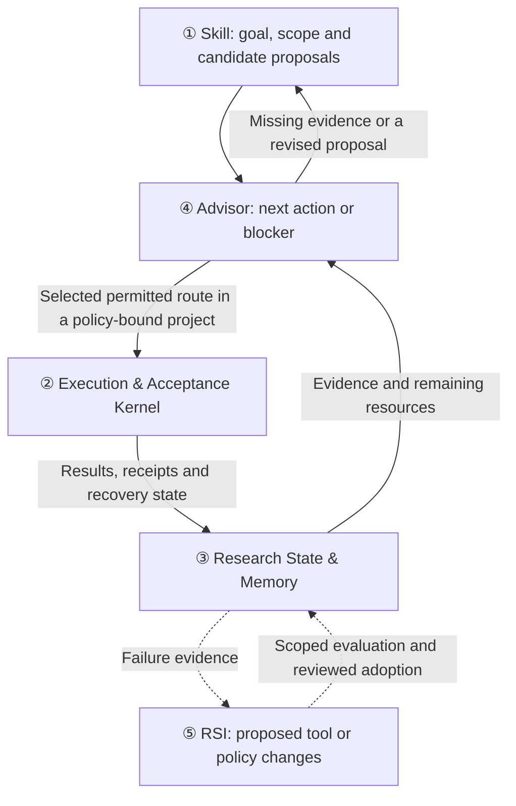

<div align="center">

<picture>
  <source media="(prefers-color-scheme: dark)" srcset=".github/assets/rds-hero-dark.svg">
  
</picture>

# Research Direction Selector

[](https://github.com/kongtou20070406/research-direction-selector/stargazers)
[](https://github.com/kongtou20070406/research-direction-selector/releases)
[](LICENSE)
[](https://github.com/kongtou20070406/research-direction-selector/actions/workflows/test.yml)

**Your agent proposes. The program keeps the books.**

**Evidence-driven autoresearch for academic research.**

A local research kernel for academic research with Codex, Claude Code and other coding agents. Use it when costly experiments span sessions and you need to retain their inputs, failures, receipts and remaining budget. Wrap a command to record execution, use the Skill to discuss evidence, or configure an Advisor-owned campaign to select permitted routes.

[RDS in autoresearch workflows](docs/autoresearch.md) · [CPU receipt and recovery example](examples/autoresearch-receipts/README.md) · [Cite this software](CITATION.cff)

**English** · [Simplified Chinese](README.zh-CN.md) · [Japanese](README.ja-JP.md)

</div>

<br />

## Why RDS

An agent's effort is expensive, stochastic and hard to optimize. A program's effort is cheap, deterministic and testable. Yet in agent-driven research, the agent usually carries everything: the goal it was given, the metric it promised, the runs it already paid for, the budget left, and the ideas that already failed. Long jobs, quotas and new sessions are where that memory breaks.

RDS moves every part of that bookkeeping that needs no judgment out of the agent and into a local, append-only ledger. The agent keeps the work that only it can do: framing hypotheses, choosing what to compare and interpreting evidence with you.

| Without RDS, an agent… | With RDS… |
| :--- | :--- |
| relaunches a slow job it lost track of and pays twice | an identical registered call reuses its recorded run and receipt |
| moves the metric or threshold after seeing the result | metric, threshold, data and evaluator are hash-bound before the first run |
| reads exit code 0 as "it worked" | a failed goal predicate stays `FALSE`; missing or inconclusive support stays `UNKNOWN` |
| starts a new session and retries a route that was already rejected | the ledger survives sessions; Advisor flags repeated rejected routes and oscillating decisions |
| tracks the remaining budget in its head | wall and CPU budgets are reserved before dispatch; failed and timed-out attempts still count |

## Measured, not promised

We test RDS with real agents on synthetic tasks that have a known answer, and publish negative results as well as positive ones.

- **Costly runs with a quota.** In a launch-decision task (gpt-6-luna, medium effort, 12 trials per arm with 20 s and 60 s query latency), agents given the experimenter's plan as prompt text spent quota on duplicate queries in 6/12 trials and reached the wrong decision in 4/12. Every wrong decision followed duplicate queries. With the same plan frozen and executed by the RDS kernel, 0/12 were wrong and 1/12 had duplicate queries; in that trial the agent called the runner directly while the kernel's run was still in progress (two-sided Fisher p ≈ 0.09 for wrong decisions; [design and data](https://github.com/kongtou20070406/research-direction-selector/issues/166#issuecomment-5974529436)).
- **Where RDS does not help (yet).** On trap tasks that are cheap to re-check, unaided Codex reached no wrong conclusion in 80 trials across three reasoning-effort levels. RDS did not raise accuracy there; it added receipts, recovery and escape resistance, at a 20–50% time cost ([h1–h3 reports](https://github.com/kongtou20070406/research-direction-selector/issues/120#issuecomment-5969647240)).

These are small samples with one model family. They support a narrow claim: the kernel's value is exactly-once, auditable execution of costly work. They do not show that RDS makes a model a better scientist. Turning research guidance into a measurable gain is the focus of the [5.9 planning thread](https://github.com/kongtou20070406/research-direction-selector/issues/166).

## Try it in two minutes

Requires Git and Python 3.11+; this CPU example uses only the standard library.

**1. Let your agent install it.** Give this to Codex, Claude Code or an agent with shell access:

```text
Install Research Direction Selector from
https://github.com/kongtou20070406/research-direction-selector
as the research-direction-selector agent Skill.
Keep the whole repository, including scripts, references, and examples.
Use this project's .agents/skills directory and verify the CLI version.
Then read SKILL.md and help me start from my actual research question.
```

**2. Run the included CPU example.** From your project directory, choose a new empty `./rds-demo` directory:

```powershell
python -B .agents/skills/research-direction-selector/examples/autoresearch-receipts/run.py --workspace ./rds-demo
```

The example fits a constant and a line to the included synthetic data. It runs each arm through RDS, repeats the identical call and checks that the original receipt, run count and budget remain unchanged. The printed result and `rds-demo/summary.json` include these fields:

```json
{
  "results": {
    "control": {"reuse": "EXISTING_JOB"},
    "treatment": {"reuse": "EXISTING_JOB"}
  },
  "scientific_support": "UNKNOWN"
}
```

This is an excerpt; the full report includes metrics and receipt identities. The [example guide](examples/autoresearch-receipts/README.md) explains the retained outputs. To wrap your own job, replace the example command with your existing script and declare its inputs and outputs as described in [wrap a command](docs/agent-entry.md#wrap-a-command).

**3. Ask in plain language.** For example:

```text
Use RDS to inspect why the metric has stopped improving. Use the existing logs to distinguish training problems from capacity limits.
Use RDS to review these two ablations that change several things at once. Design a minimal fair comparison that distinguishes the explanations.
Use RDS to continue this project. Check the remaining budget and completed runs before proposing new work.
Use RDS to evaluate the current contraction hypothesis and generate checked evidence for a supported formal statement.
```

More prompts and help with `[RDS-REJECT]` are in the [quick start](docs/quickstart.md).

---

## Two sides of the research loop

RDS is an Advisor-centered research decision system with two cooperating sides and one recorded research state:

**Agent side** — the `research-direction-selector` Skill (`SKILL.md`) guides agents such as Codex and Claude Code to clarify the original goal, propose hypotheses and candidate routes, check application assumptions, and interpret evidence with the researcher.

**Program side** — the local CLI (`scripts/rds_cli.py`) binds supported actions to source, inputs and resources, checks admission and records results and receipts. In a project with a frozen `advisor_policy`, it updates program-owned state and uses Advisor to select the next permitted route before dispatch.

The loop is **goal and constraints → Advisor decision → constrained execution → results and receipts → updated research state → Advisor**. Project records live in `.rds/`; `references/judgment-graph.yaml` supplies scoped methodology rules, not an automatically rewritten collection of proven causal laws.

The latest stable release is [5.8.0](https://github.com/kongtou20070406/research-direction-selector/releases/tag/v5.8.0). The development checkout identifies itself as `5.9.0-rc.2`; publication is pending. See the [preview notes](docs/releases/5.9.0-rc.2-preview.md) for its scope and the [evaluation plan](https://github.com/kongtou20070406/research-direction-selector/issues/166) for research-capability claims.

---

## 5 Core Functional Components

The five components share one recorded research state:

| Core component | Main responsibility | Question it answers |
| :--- | :--- | :--- |
| **① Research protocol: Skill** | Guides the agent to understand goals, frame hypotheses, design controls, and plan the next step | **How should we reason about and advance this research?** |
| **② Execution & Acceptance Kernel** | Manages experiment state, invokes execution tools, collects results, and checks budgets and evidence | **How do we run the experiment? Which predefined conditions do the results satisfy?** |
| **③ Research State & Memory** | Preserves goals, configurations, results, failure conditions, and decision evidence across sessions | **What have we done, what do we know, and why did we reach this point?** |
| **④ Advisor Engine** | Connects the original goal, current evidence, constraints and candidate routes to a next action or an explicit blocker | **What can we execute next, and what evidence would change the decision?** |
| **⑤ Self-Improvement Module: RSI** | Proposes rule or policy changes and evaluates them before adoption | **Which of RDS's own judgments and practices should improve?** |



Skill guides the agent's research reasoning; Advisor uses recorded evidence to suggest or select the next route; RSI evaluates changes to RDS's own rules, tools and policies. Their inputs and evidence limits are explained in [research workflow](docs/research-workflow.md). [Autonomy scope](docs/research-autonomy.md) describes capability levels and the claims that still require research evaluation.

---

## Skill: agent-first research guidance

The Skill is what your agent reads. It tells the agent when to call the kernel, how to state a fair comparison, and how to report results without upgrading `UNKNOWN` to success.

### Install

The recommended agent-driven install is in [Try it in two minutes](#try-it-in-two-minutes). For Claude Code/Codex plugins and the OMP extension with compact invocation status, see [host plugin packaging](docs/host-plugins.md). The standalone Skill installation remains supported.

#### Manual install

For the project-local installation used above, run these commands from your project directory:

```powershell
New-Item -ItemType Directory -Path .agents/skills -Force | Out-Null
git clone https://github.com/kongtou20070406/research-direction-selector.git .agents/skills/research-direction-selector
python -B .agents/skills/research-direction-selector/scripts/rds_cli.py --version
```

For a user-wide installation, use the following paths instead:

```powershell
New-Item -ItemType Directory -Path "$env:USERPROFILE/.agents/skills" -Force | Out-Null
git clone https://github.com/kongtou20070406/research-direction-selector.git "$env:USERPROFILE/.agents/skills/research-direction-selector"
python -B "$env:USERPROFILE/.agents/skills/research-direction-selector/scripts/rds_cli.py" --version
```

For the user-wide install, run the demo with the quoted installed path:

```powershell
python -B "$env:USERPROFILE/.agents/skills/research-direction-selector/examples/autoresearch-receipts/run.py" --workspace ./rds-demo
```

Keep your project as the current directory and pass its root to the CLI. Commands beginning with `scripts/` or `examples/` later in this README assume the repository root; the [entry guide](docs/agent-entry.md) explains how to resolve installed paths. Existing installation directories should be inspected rather than overwritten.

---

## Deterministic Execution & Acceptance Kernel

The kernel (`scripts/rds_cli.py`) runs on Python 3.11+ with the standard library. `exec` records one wrapped command; a project contract binds a pre-registered comparison. Registered calls reuse their recorded execution; commands launched outside RDS remain outside that control.

Run the following CPU demonstration from the repository root, using a new empty `./my-project` directory. The preparation step creates the bound contract and manifests for both arms; this demonstration does not establish scientific confirmation. See the [project-runner example](examples/project-runner/README.md) for execution and receipt details.

```powershell
# 0. Prepare the example contract, data, and manifests
python -B examples/project-runner/prepare.py --root ./my-project

# 1. Initialize research state from contract
python -B scripts/rds_cli.py --root ./my-project project init --contract ./my-project/contract.json

# 2. Create and execute both arms with transactional budget
python -B scripts/rds_cli.py --root ./my-project project create --manifest ./my-project/control.json
python -B scripts/rds_cli.py --root ./my-project project execute --id control
python -B scripts/rds_cli.py --root ./my-project project create --manifest ./my-project/treatment.json
python -B scripts/rds_cli.py --root ./my-project project execute --id treatment

# 3. Check costs and status
python -B scripts/rds_cli.py --root ./my-project project costs
python -B scripts/rds_cli.py --root ./my-project project status
```

For this example without `advisor_policy`, the kernel derives a procedural next step from recorded ledger state. Run
`python -B scripts/rds_cli.py --root ./my-project project next` at any point to
print the one action to take now (register, execute, recover, compare or record
the decision) with its runnable command; agents can drive the whole loop by
repeating that step without memorizing the sequence above.

CLI invocations are logged locally by default. Show daily use with
`python -B scripts/rds_cli.py usage --days 7`, or select an inclusive range with
`usage --since 2026-09-01 --until 2026-10-01`. Add `--json` for command totals and
structured daily counts. See [CLI usage](docs/cli-usage.md) for tracking coverage
and the local log location.

---

## Lean4-style Declarative Formal Verification

`scripts/rds_verify.py` checks a declared mathematical statement and returns its status, assurance and any certificate. Use it for the supported domains below; broader claims need their own verifier or proof. Its bounded tactic interface is inspired by Lean-style workflows.

- **Supported statements** — Checks rational relations, affine dynamics, scoped matrix spectral bounds, supported Linear/ReLU properties, concrete tensors, exact unit-disk covers and registered native Lean obligations. Finite theorem modules compose supported statements. The [formal reference](docs/formal-verification.md) describes the rules and assurance labels; methodology guidance lives separately in the judgment graph.
- **Bounded tactic dispatcher** — `LeanFormalEngine().verify(spec, tactics)` accepts `rule`, `gershgorin`, `spectral_radius`, `scale_invariance`, `interval`, and `lean4`. Tactics select compatible registered checks; unsupported or inconclusive inputs return `UNKNOWN`.
- **Native Lean 4 adapter** — With a configured native Lean executable, fixed-template closed rational `eq`, `lt`, or `le` obligations receive `LEAN_KERNEL_CHECKED` after native rechecking and an empty-axiom audit. It does not accept arbitrary Lean source or user tactics.

From the repository root, verify the included declaration and replay its certificate:

```powershell
python -B scripts/rds_cli.py --root . formal verify --spec examples/formal/theorem_module.json --output proof.json --no-cache
python -B scripts/rds_cli.py --root . formal check --spec examples/formal/theorem_module.json --certificate proof.json
```

A checked mathematical statement does not establish task performance, causal isolation, or correspondence with an executed training graph. See [formal verification](docs/formal-verification.md) for schemas, assurance labels, and supported scope.

---

## Advisor: Evidence-Grounded Suggestions

[Program-owned campaigns](docs/program-owned-advisor.md) freeze the goal predicates, permitted routes and result readers. `project advance` executes at most one program-selected route, settles its receipt, collects declared outputs into the current evidence graph and returns the next Advisor report. Completed routes retain evidence without occupying executable candidate slots. Collection recovery reuses retained results rather than repeating the completed experiment. Projects without `advisor_policy` retain their caller-directed behavior.

[Bounded research drive](docs/autonomy-loop.md) connects repeated selection to authorized model proposals when a method is blocked, validates tool changes through the existing workbench/revision gate, and continues with retained costs and evidence. [Domain confirmation](docs/domain-confirmation.md) checks exact mathematical certificates, finite integer algorithm cases, and CPU tensor metrics separately from execution success. These scoped checks do not establish general scientific autonomy or independent research gains.

Advisor connects the original goal to current facts and constraints within the available candidate space. Results can enable a route, close the declared goal, expose a blocker or motivate a reformulation proposal. Agents still supply new hypotheses, check application assumptions and work with domain-specific verifiers; the program does not silently widen a frozen policy. This restricts caller cherry-picking within declared RDS entries, not commands outside RDS.

`scripts/rds_advisor.py` uses recorded evidence and the methodology graph to propose next steps:
- **Evidence before diagnosis** — A single loss value does not support an overfitting or underfitting diagnosis. Paired curves or comparable observations provide context for candidate explanations.
- **Localization before intervention** — For NaN/Inf, suggestions prioritize locating the first nonfinite value and checking precision or update paths before changing numerical safeguards.
- **Loop-history review** — Recorded checkpoints let Advisor flag a route that repeats an earlier rejection, a reopened review, or decisions that oscillate between the same options.
- **Graph-guided candidates** — Methodology rules organize diagnostic leads and exploration candidates. Their ranking does not prove a causal effect, Pareto optimality, or that an experiment satisfies every rule obligation.

```powershell
python -B scripts/rds_cli.py --root ./my-project advise
```

Real CLI workflows and regression tests demonstrate these engineering behaviors. A goal predicate can be `FALSE` even when both commands succeed; scientific support can remain `UNKNOWN` even when a numerical threshold is met. Better scientific decisions or RSI policy gain require a fair prospective comparison on unused cases at equal total budgets, including failures and evaluation costs; see [Measured, not promised](#measured-not-promised) for what has been measured so far.

---

## Obelisk History Integration

Recommended optional memory enhancement: [Obelisk](https://github.com/tommy0103/obelisk). The lightweight decision graph helps prevent repeated research loops; use Obelisk when you need exact details from past sessions, without duplicating a history store:

```powershell
python -B scripts/rds_cli.py history prepare --project-path 'C:\research\project' --terms 'C7' --output 'C:\queries\obq-c7-unique-token.mjs'
python -B scripts/rds_cli.py history query --query 'C:\queries\obq-c7-unique-token.mjs'
```

---

## Verification & Tests

For the regression suite, optional formal dependencies and development checks, follow [CONTRIBUTING](CONTRIBUTING.md#performance-and-final-acceptance). Historical replay and red-team scope are described in the [benchmark guide](benchmark/README.md).

---

## Repository layout

```text
SKILL.md                         Agent collaboration protocol (Component ①)
scripts/rds_cli.py               Execution kernel & transactional budget ledger (Component ②)
scripts/rds_probe.py             Restricted AST and scalar formal admission checks (Component ②)
scripts/rds_verify.py            Declarative rules, bounded tactics & certificate checking (Component ②)
scripts/rds_compress.py          Telemetry log compression & spike monitor (Component ②)
references/judgment-graph.yaml   Methodology judgment graph (Component ③)
references/                      State machine contracts & RSI evidence (Component ③)
scripts/rds_obelisk.py           Obelisk session history bridge (Component ③)
scripts/rds_advisor.py           Evidence-grounded Advisor engine (Component ④)
scripts/rds_meta.py              RSI rule reflection & graph mutation (Component ⑤)
scripts/rds_adversary.py         RSI adversarial variants and evaluation candidates (Component ⑤)
benchmark/                       Historical decision packets & red-team benchmarks
tests/                           Full regression test suite
```

---

## Get involved

RDS is built in the open, and the most useful contributions right now are not only code:

- **Hard tasks for agents.** A synthetic task where an unaided agent reaches a wrong conclusion is worth more to us than a new feature. Benchmark fixtures, graders and agent-trial reports are welcome ([#169](https://github.com/kongtou20070406/research-direction-selector/issues/169)).
- **Your research workflow.** Tell us where your agent loses track of runs, budgets or rejected ideas. Real failure modes shape the roadmap.
- **Hosts and adapters.** Plugins for more agent hosts, execution backends and formal-verification adapters.
- **Translations and docs.** The READMEs exist in English, Chinese and Japanese; corrections are welcome.

Start with the [contribution guide](CONTRIBUTING.md), browse [open issues](https://github.com/kongtou20070406/research-direction-selector/issues), or open one describing your research problem.

---

## Star history

<a href="https://www.star-history.com/#kongtou20070406/research-direction-selector&Date">
  <picture>
    <source media="(prefers-color-scheme: dark)" srcset="https://api.star-history.com/svg?repos=kongtou20070406/research-direction-selector&type=Date&theme=dark">
    
  </picture>
</a>

The chart is loaded from the public Star History service and only reflects GitHub stars over time; it carries no research meaning.

---

## License

Apache License 2.0. See [LICENSE](LICENSE) for details.
