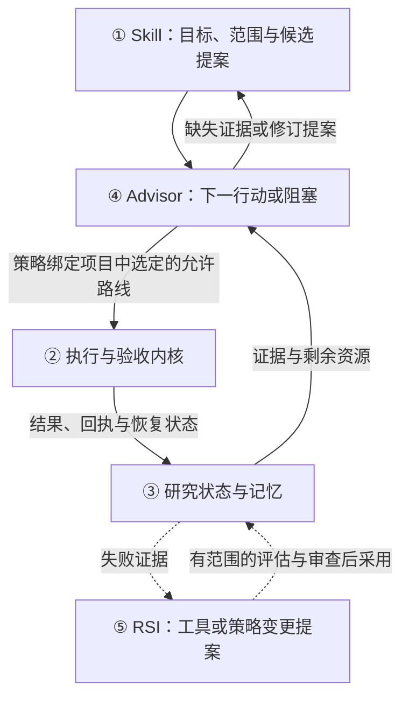

<div align="center">

<picture>
  <source media="(prefers-color-scheme: dark)" srcset=".github/assets/rds-hero-dark.svg">
  
</picture>

# Research Direction Selector

[](https://github.com/kongtou20070406/research-direction-selector/stargazers)
[](https://github.com/kongtou20070406/research-direction-selector/releases)
[](LICENSE)
[](https://github.com/kongtou20070406/research-direction-selector/actions/workflows/test.yml)

**Agent 出主意，程序来记账。**

**面向学术研究、由证据驱动的 autoresearch。**

面向学术研究及 Codex、Claude Code 等编程 Agent 实验工作流的本地科研内核。它在执行前冻结目标、输入与评估器，预留预算，保留执行回执，并跨会话延续已记录的证据。用它规划有界实验、恢复中断工作，并核验受支持的结果。

[RDS 如何参与 autoresearch 工作流](docs/autoresearch.md) · [CPU 回执与恢复示例](examples/autoresearch-receipts/README.md) · [引用本软件](CITATION.cff)

[English](README.md) · **简体中文** · [日本語](README.ja-JP.md)

</div>

<br />

## 为什么需要 RDS

Agent 的算力昂贵、结果随机、难以优化；程序的算力便宜、行为确定、可以测试。可在 Agent 驱动的科研里，几乎所有事情都压在 Agent 身上：最初的目标、承诺的指标、已经花钱跑过的实验、剩余预算、已经失败的想法。长任务、额度限制和换会话，正是这份记忆最容易断掉的地方。

RDS 把其中所有不需要判断的记账工作从 Agent 身上移走，放进本地只追加的账本。Agent 只保留只有它能做的部分：提出假说、决定比较什么，并和你一起解读证据。

| 没有 RDS，Agent 会…… | 有了 RDS…… |
| :--- | :--- |
| 忘了慢任务已经在跑，又重跑一次、花两份钱 | 每个已注册的运行只执行一次；相同调用直接返回已有回执 |
| 看到结果后再改指标或阈值 | 指标、阈值、数据和评价器在首次运行前按哈希绑定 |
| 把退出码 0 当成"成功了" | 未满足的目标谓词保持 `FALSE`；缺失或不确定的支持保持 `UNKNOWN` |
| 换个会话又去试一条早被否掉的路线 | 账本跨会话保存；Advisor 会标记重复已否决路线和来回摇摆的决定 |
| 靠记忆估算剩余预算 | 派发前预留墙钟和 CPU 预算；失败与超时的尝试同样计入 |

## 已测到的，而非承诺的

我们用真实 Agent 在有标准答案的合成任务上测试 RDS，正面和负面结果都公开。

- **有额度的昂贵运行。** 在一个上线决策任务中（gpt-6-luna，medium 推理强度，每组 12 次，查询延迟分别为 20 秒和 60 秒）：把实验者的计划作为提示文本交给 Agent，有 6/12 次因重复查询浪费额度，4/12 次得出错误决定，且每次错误都发生在重复查询之后。同一份计划冻结后交由 RDS 内核执行，错误为 0/12，出现重复查询的只有 1/12；那一次是 Agent 在内核运行尚未结束时直接调用了查询脚本。错误决定的双侧 Fisher 检验 p ≈ 0.09（[设计与数据](https://github.com/kongtou20070406/research-direction-selector/issues/166#issuecomment-5974529436)）。
- **RDS（暂时）帮不上忙的地方。** 在复查成本很低的陷阱任务上，不用 RDS 的 Codex 在三档推理强度、共 80 次试验中没有一次得出错误结论。RDS 在这些任务上没有提高正确率；它带来的是回执、可恢复性和防逃逸，代价是多花 20%–50% 的时间（[h1–h3 报告](https://github.com/kongtou20070406/research-direction-selector/issues/120#issuecomment-5969647240)）。

这些都是小样本，且只测了一个模型系列。它们只支持一个窄结论：内核的价值在于对昂贵工作做到恰好一次、可审计的执行。它们不能说明 RDS 让模型成为更好的科学家。如何把科研指导变成可测量的收益，正是 [5.9 规划讨论](https://github.com/kongtou20070406/research-direction-selector/issues/166)的重点。

## 两分钟上手

**1. 让 Agent 安装。** 把下面这段交给 Codex、Claude Code 或任何具备终端访问能力的 Agent：

```text
从以下地址安装 Research Direction Selector：
https://github.com/kongtou20070406/research-direction-selector
将其作为 research-direction-selector 智能体 Skill。
保留完整仓库，包括 scripts、references 和 examples。
使用当前项目的 .agents/skills 目录，并验证 CLI 版本。
然后阅读 SKILL.md，从我的实际研究问题开始协作。
```

**2. 包裹一条昂贵命令。** 不需要契约或 JSON。在你的项目目录中运行（Python 3.11+，仅需标准库）：

```powershell
python -B .agents/skills/research-direction-selector/scripts/rds_cli.py --root . exec --name train-001 -t 600 -o outputs/result.json train.py
```

RDS 会把输入复制到冻结的任务目录，预留时间上限，运行任务，并在 `.rds/` 中记录回执。再次运行同一条命令，它返回 `EXISTING_JOB`，不会再花一次钱。绑定、输出和限制见[包裹命令](docs/agent-entry.md#wrap-a-command)。

**3. 用日常语言提问。** 例如：

```text
用 RDS 检查为什么指标不再提升。利用现有日志区分训练问题和容量限制。
用 RDS 审查这两个同时改变多项因素的消融实验。设计一个最小公平比较，以区分不同解释。
用 RDS 继续这个项目。先检查剩余预算和已完成的运行，再提出新工作。
用 RDS 评估当前的收缩性假说，并为支持的形式化陈述生成经过检查的证据。
```

更多可复制的提示词，以及遇到 `[RDS-REJECT]` 时该怎么做，见[快速入门](docs/quickstart.zh-CN.md)。

---

## 科研闭环的两端

RDS 是以 Advisor 为决策中心的研究系统，两端协作并共享已记录的研究状态：

**Agent 端** — `research-direction-selector` 技能（`SKILL.md`）指导 Codex、Claude Code 等 Agent 明确原始目标、提出假说与候选路线、检查应用前提，并与研究者共同解读证据。

**程序端** — 本地 CLI（`scripts/rds_cli.py`）将支持的行动绑定到源码、输入与资源，检查准入并保存结果和回执。具有冻结 `advisor_policy` 的项目会更新程序持有的状态，并由 Advisor 在派发前选择下一条允许的路线。

闭环为 **目标与约束 → Advisor 决策 → 受约束执行 → 结果与回执 → 更新研究状态 → Advisor**。项目记录保存在 `.rds/`；`references/judgment-graph.yaml` 提供有适用范围的方法论规则，并非自动改写的、已获证明的因果规律集合。

5.8.0 仍是最新稳定版。下一份 5.9 预览版为 `5.9.0-rc.2`，范围及发布验证见[预览说明](docs/releases/5.9.0-rc.2-preview.md)。它尚未证明科研能力提升；验证方案见 [5.9 评估计划 #166](https://github.com/kongtou20070406/research-direction-selector/issues/166)。

---

## 5 个核心功能组件

按职责划分，RDS 有 **5 个核心组件**：3 个基础组件和 2 个增强组件。

| 核心组件 | 主要职责 | 它回答的问题 |
| :--- | :--- | :--- |
| **① 科研规程：Skill** | 引导 Agent 理解目标、提出假说、设计对照并规划下一步 | **这轮研究应该怎样思考和推进？** |
| **② 执行与验收内核** | 管理实验状态、调用运行工具、收集结果，检查预算和证据 | **实验怎么跑？结果满足哪些预定条件？** |
| **③ 研究状态与记忆** | 跨会话保存目标、配置、结果、失败条件和决策依据 | **我们已经做过什么、知道什么，为什么走到这里？** |
| **④ Advisor 建议引擎** | 将原始目标、当前证据、约束与候选路线连接到下一行动或明确阻塞 | **接下来可以执行什么，什么证据会改变决定？** |
| **⑤ 自改进模块：RSI** | 提出规则或策略修改，并在采用前进行评测 | **RDS 自己哪些判断和做法需要改进？** |



### 容易混淆的三组关系

- **Skill 和 Advisor：** Skill 定义研究的基本做法，例如公平对照，以及指标与机制的区别。Advisor 针对当前情况提出行动建议，例如检查训练是否充分，或尝试另一条候选路线。
- **记忆和 Advisor：** 记忆保存发生过什么及其证据。Advisor 利用这些记录，建议接下来值得检查什么。
- **Advisor 和 RSI：** Advisor 支持当前科研决策；有用的建议不等于任务收益已获证明。RSI 评估 **RDS 自身的规则、工具和决策策略** 变更；工程验收与科学决策收益提高需要不同证据。

### 其他名称属于哪里？

- **预算控制、基线缓存、日志提取、探针和形式化检查**主要属于 **② 执行与验收内核** 的底层模块。
- **`.rds/` 项目记录、Obelisk 历史接口和判断图谱（`judgment-graph.yaml`）**主要属于 **③ 研究状态与记忆**，供其他组件读取。
- **L1–L5** 是研究框架中讨论的[能力层级](docs/research-autonomy.md)，不是额外组件。

五个组件是同一闭环中的五项职责。Advisor 是证据与下一行动之间的决策接口；这不意味着每个连接都已自主执行，也不证明闭环提高了科学收益。见[科研工作流](docs/research-workflow.zh-CN.md)和[自主程度边界](docs/research-autonomy.md)。

---

## Skill：以 Agent 为入口的科研指导

Skill 是 Agent 阅读的部分。它告诉 Agent 何时调用内核、如何表述公平比较，以及如何报告结果而不把 `UNKNOWN` 说成成功。

### 安装

推荐的 Agent 安装方式见[两分钟上手](#两分钟上手)。Claude Code、Codex 插件及带简短调用状态的 OMP 扩展见[宿主插件打包指南](docs/host-plugins.md)。原有独立 Skill 安装方式继续支持。

#### 手动安装

```powershell
New-Item -ItemType Directory -Path "$env:USERPROFILE/.agents/skills" -Force | Out-Null
git clone https://github.com/kongtou20070406/research-direction-selector.git "$env:USERPROFILE/.agents/skills/research-direction-selector"
```

---

## 确定性的执行与验收内核

内核（`scripts/rds_cli.py`）仅使用 Python 3.11+ 标准库。单条命令用 `exec` 包裹；需要预先登记的对照比较时，使用项目契约。

从仓库根目录运行以下 CPU 演示，并使用全新的空目录 `./my-project`。准备步骤会为对照组和实验组创建绑定契约及清单；本演示不构成科学结论的确认。执行与回执细节见[项目执行器示例](examples/project-runner/README.md)。

```powershell
# 0. 准备示例契约、数据和清单
python -B examples/project-runner/prepare.py --root ./my-project

# 1. 根据契约初始化研究状态
python -B scripts/rds_cli.py --root ./my-project project init --mode quick --contract ./my-project/contract.json

# 2. 在事务级预算管理下创建并执行两组
python -B scripts/rds_cli.py --root ./my-project project create --manifest ./my-project/control.json
python -B scripts/rds_cli.py --root ./my-project project execute --id control
python -B scripts/rds_cli.py --root ./my-project project create --manifest ./my-project/treatment.json
python -B scripts/rds_cli.py --root ./my-project project execute --id treatment

# 3. 检查成本和状态
python -B scripts/rds_cli.py --root ./my-project project costs
python -B scripts/rds_cli.py --root ./my-project project status
```

本例没有 `advisor_policy`，内核会从账本状态推导程序流程的下一步。任意时刻运行
`python -B scripts/rds_cli.py --root ./my-project project next`，
即可打印当前应做的一步（注册、执行、恢复、对比或记录决定）及其可运行命令；
智能体重复这一步即可驱动整个循环，无需记住上面的命令序列。

CLI 默认在本机记录调用。用 `python -B scripts/rds_cli.py usage --days 7` 查看每天的次数，
或用 `usage --since 2026-09-01 --until 2026-10-01` 查看包含起止日期的区间。
加 `--json` 可取得命令分类和逐日统计。开始记录前的日期显示“未记录”；详见
[调用日志](docs/cli-usage.md)。

---

## Lean4 风格的声明式形式化验证

`scripts/rds_verify.py` 提供有限声明式陈述、已注册的领域规则和独立证书检查。其有限战术接口借鉴了 Lean 风格的证明工作流；它不是通用的 Lean 或 Mathlib 证明器。

- **可信规则注册表** — 注册了 15 条原子数学规则，覆盖有理数标量阈值、仿射动力学、适用范围明确的矩阵谱检查、支持的 Linear/ReLU 性质、具体张量、精确单位圆盘几何覆盖，以及原生 Lean 证明义务（封闭有理数关系与一项范围明确的统计义务）。有限定理模块组合这些陈述。该注册表与包含 23 个节点的方法论判断图谱彼此独立。
- **有限战术分派器** — `LeanFormalEngine().verify(spec, tactics)` 接受 `rule`、`gershgorin`、`spectral_radius`、`scale_invariance`、`interval` 和 `lean4`。战术选择兼容的已注册检查；不支持或无法确定的输入返回 `UNKNOWN`。
- **原生 Lean 4 适配器** — 配置原生 Lean 可执行程序后，固定模板的封闭有理数 `eq`、`lt` 或 `le` 证明义务，经原生复检及空公理审计后获得 `LEAN_KERNEL_CHECKED`。它不接受任意 Lean 源码或用户战术。

从仓库根目录运行以下 Python 示例：

```python
import json
import sys
from pathlib import Path

sys.path.insert(0, "scripts")
from rds_verify import LeanFormalEngine, check_certificate

spec = json.loads(Path("examples/formal/theorem_module.json").read_text(encoding="utf-8"))
result = LeanFormalEngine().verify(spec, tactics=("rule",))
assert result["status"] == "PASS"
assert result["assurance"] == "CERTIFICATE_CHECKED"
assert check_certificate(spec, result["certificate"])
```

同一声明也可通过 CLI 验证：

```powershell
python -B scripts/rds_cli.py --root . formal verify --spec examples/formal/theorem_module.json --output proof.json --no-cache
python -B scripts/rds_cli.py --root . formal check --spec examples/formal/theorem_module.json --certificate proof.json
```

经过检查的数学陈述不能证明任务性能、因果隔离，或其与实际执行的训练图一致。数据结构、保证等级标签和支持范围见[形式化验证](docs/formal-verification.md)。

---

## Advisor：基于证据的建议

[程序持有证据的工作流](docs/program-owned-advisor.md)先固定目标谓词、允许的路线和结果读取规则。`project advance` 至多执行一条由程序选定的路线，结算回执、收集已声明输出到当前证据图，并返回下一次 Advisor 报告。已完成路线保留证据，但不再占用可执行候选名额。采集恢复复用已有结果，不重复已完成的实验。没有 `advisor_policy` 的项目保留原有调用方引导方式。

[有界科研推进](docs/autonomy-loop.md)通过 `project drive` 串联连续选路、受阻后的模型改法或工具改进、工作台修订验证和原任务恢复，保留原始预算与失败证据。[领域确认](docs/domain-confirmation.md)分别检查数学精确证书、有限整数算法案例和 CPU 张量指标。执行成功与领域确认分开报告；这些有限检查不证明通用科研自动驾驶或独立科研收益。

Advisor 在已有候选空间内，将原始目标连接到当前事实与约束。结果可能使一条路线可执行、使声明目标成立、暴露阻塞，或促使提出转向方案。Agent 仍需提供新假说、检查应用前提并配合领域验证器；程序不会悄然扩大冻结策略。这限制的是已声明 RDS 入口内的信息挑选，不是 RDS 外部命令。

`scripts/rds_advisor.py` 利用已记录的证据和方法论图谱提出下一步建议：
- **先有证据，再做诊断** — 单个 loss 值不足以支持过拟合或欠拟合诊断。成对曲线或可比较的观测为候选解释提供背景。
- **先定位，再干预** — 遇到 NaN/Inf 时，建议优先定位第一个非有限值，并检查精度或更新路径，再调整数值保护措施。
- **回顾循环历史** — 已记录的检查点让 Advisor 能标记重复先前否决的路线、重新打开的审查，以及在同几个选项之间来回摇摆的决定。
- **图谱引导候选方案** — 方法论规则组织诊断线索和探索候选方案。候选排序不能证明因果效应、帕累托最优性，或某项实验满足所有规则义务。

```powershell
python -B scripts/rds_cli.py --root ./my-project advise
```

真实 CLI 工作流和回归测试验证的是上述工程行为。即使两个命令都成功，目标谓词仍可能为 `FALSE`；即使达到数值阈值，科学支持仍可能为 `UNKNOWN`。更好的科研决策或 RSI 策略收益需要在未用过的案例上，以相同总预算进行公平的前瞻比较，并计入失败和评估成本；目前已测到的结果见[已测到的，而非承诺的](#已测到的而非承诺的)。

---

## Obelisk 历史集成

推荐可选记忆增强：[Obelisk](https://github.com/tommy0103/obelisk)。轻量决策图用于防止科研打转；需要过去会话的精确信息时使用 Obelisk，不重复建立历史存储：

```powershell
python -B scripts/rds_cli.py history prepare --project-path 'C:\research\project' --terms 'C7' --output 'C:\queries\obq-c7-unique-token.mjs'
python -B scripts/rds_cli.py history query --query 'C:\queries\obq-c7-unique-token.mjs'
```

---

## 验证与测试

```powershell
# 运行完整测试套件
python -m unittest discover -s tests -p "test_*.py" -v

# 运行历史案例回放
python benchmark/run.py

# 运行对抗性红队压力测试
python benchmark/redteam/runner.py
```

---

## 仓库结构

```text
SKILL.md                         Agent 协作规程（组件 ①）
scripts/rds_cli.py               执行内核与事务级预算账本（组件 ②）
scripts/rds_probe.py             受限 AST 与标量形式化准入检查（组件 ②）
scripts/rds_verify.py            声明式规则、有限战术与证书检查（组件 ②）
scripts/rds_compress.py          遥测日志压缩与尖峰监测（组件 ②）
references/judgment-graph.yaml   23 节点的方法论判断图谱（组件 ③）
references/                      状态机契约与 RSI 证据（组件 ③）
scripts/rds_obelisk.py           Obelisk 会话历史桥接（组件 ③）
scripts/rds_advisor.py           基于证据的 Advisor 引擎（组件 ④）
scripts/rds_meta.py              RSI 规则反思与图谱修改（组件 ⑤）
scripts/rds_adversary.py         RSI 对抗性变体与评测候选方案（组件 ⑤）
benchmark/                       历史决策包与红队基准
tests/                           完整回归测试套件
```

---

## 参与进来

RDS 公开开发。眼下最有用的贡献不只是代码：

- **能难住 Agent 的任务。** 一个让不用 RDS 的 Agent 得出错误结论的合成任务，对我们比一个新功能更有价值。欢迎提交基准夹具、评分器和 Agent 试验报告（[#169](https://github.com/kongtou20070406/research-direction-selector/issues/169)）。
- **你的科研工作流。** 告诉我们你的 Agent 在哪里弄丢了运行记录、预算或被否掉的想法。真实的失败模式决定路线图。
- **宿主与适配器。** 更多 Agent 宿主的插件、执行后端和形式化验证适配器。
- **翻译与文档。** README 有英文、中文和日文版本，欢迎指正。

从[贡献指南](CONTRIBUTING.zh-CN.md)开始，浏览[开放的 issue](https://github.com/kongtou20070406/research-direction-selector/issues)，或者新开一个 issue 描述你的科研问题。

---

## Star 趋势

<a href="https://www.star-history.com/#kongtou20070406/research-direction-selector&Date">
  <picture>
    <source media="(prefers-color-scheme: dark)" srcset="https://api.star-history.com/svg?repos=kongtou20070406/research-direction-selector&type=Date&theme=dark">
    
  </picture>
</a>

该图表由公开的 Star History 服务加载，仅反映 GitHub star 随时间的变化，不含科研含义。

---

## 许可证

Apache License 2.0。详情见 [LICENSE](LICENSE)。
