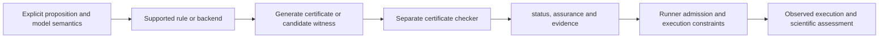

# Formal verification: declarations, checks and scope

[简体中文](formal-verification.zh-CN.md) · [Documentation](README.md) · [Research workflow](research-workflow.md) · [Terminology](terminology.md)

RDS separates a mathematical proposition from the experiment that tests utility or mechanism. A verifier checks an explicit property under explicit semantics. The research runner separately checks execution constraints and records what actually happened.

## Implementation status

This checkout builds on the mathematical implementation introduced by [PR #2](https://github.com/kongtou20070406/research-direction-selector/pull/2) at `995e8eb`, together with the Advisor/dashboard integration. The table retains the older `f020b2c` base for historical comparison. Check the actual ref before using an interface; a roadmap entry is not an installed capability.

| Area | Historical base (`f020b2c`) | Current checkout | Further work |
| --- | --- | --- | --- |
| Ordinary scalar execution | Restricted rational AST and paired MSE; `AST_ONLY` admission. | Preserved. | Remains distinct from mathematical verification. |
| Declared scalar boundary | Optional SymPy; `SYMBOLIC_CHECKED`; unsupported cases yield `UNKNOWN`. | Typed statements, an exact affine-rational certificate generator and a separate checker. | Extend coverage while preserving statement and evidence bindings. |
| Certificate reuse | No independently checked certificate path. | Bound scalar certificates and a rebuildable generic proof cache; hits are independently checked. Solving stays outside the short reservation write transaction. | Preserve dependency bindings as adapters expand. |
| Network properties | No network verifier. | Registered rational Linear/ReLU bounds, margins and positive-scale equivariance. | Broader operators and explicit export/runtime correspondence. |
| Matrix and dynamics properties | `dynamics` is unsupported and returns `UNKNOWN`. | Registered rational affine contraction/fixed-point checks, a witness synthesizer that reduces the model to Lean coordinate goals, and scoped spectral-radius checks. | Broader dynamics and norms with separate sound checkers. |
| Native Lean | No native Lean adapter. | Closed Rat templates plus the optional pinned mathlib library and conditional Ville/Hoeffding/DPI theorem audits. | Instantiated statistical protocols and checked empirical applicability. |
| Framework, tensors and exports | No general theorem command or model export. | `formal` CLI, finite theorem modules, a typed proof-plan runner, concrete exact tensor checks and a restricted Python model-export API. | More artifact schemas and compatible adapters. |

The interfaces below describe this checkout. The [original implementation contract](https://github.com/kongtou20070406/research-direction-selector/blob/995e8eb98f75697ef1ce43a9991f0686e5c29caa/references/formal_framework.md) records the earlier source revision; use the installed revision's registrations and tests. The initial PR commit `8eadae9` covered only the scalar certificate path and is not the interface snapshot described here.

## Declaration and independent checking

The implementation uses `scripts/rds_verify.py` and the `formal` CLI, with finite schema-1 specifications. Its trusted atomic rule registry and finite theorem-module composition are distinct from the methodology catalog. JSON cannot register executable rules or user axioms. Atomic declarations select a rule through `kind`; named module declarations use `by.rule`, not a top-level `rule_id`.

| Specification kind | Framework rule / supported obligation |
| --- | --- |
| `scalar_threshold` | `scalar.threshold_separation`: defined closed-domain control bound and a rational treatment witness. |
| `lean_obligation` / `lean_vector_obligation` | `lean.rational_relation`: native Lean checking of a fixed-template closed rational relation or a conjunction of up to 32 coordinate relations. |
| `affine_fixed_point_synthesis` | `dynamics.affine_fixed_point_synthesis`: bounded exact rational witness search for a 1..32D map or an ordered chain of up to 8 maps, followed by registered composition and fixed-point checks plus native Lean coordinate proofs. |
| `statistical_obligation` | `lean.statistical_obligation`: native audit of a pinned conditional Ville, Hoeffding or Markov mutual-information DPI theorem; empirical application remains `UNKNOWN`. |
| `affine_contraction` / `affine_fixed_point` / `affine_dynamics` | `matrix.infinity_contraction` / `matrix.fixed_point` / `dynamics.affine`: induced infinity norm, a specified fixed point, or both. |
| `matrix_spectral_bound` / `matrix_spectral_exact` | `matrix.gershgorin` / `matrix.spectral_radius`: triangular matrices are decided exactly; other matrices use a sufficient bound for the former and remain `UNKNOWN` for the latter. An inconclusive sufficient bound remains `UNKNOWN`. |
| `scale_equivariance` | `network.positive_homogeneity`: the supported Linear/ReLU model's declared positive-scale identity; distinct from scale invariance. |
| `network_bounds` / `network_margin` | `network.interval_bounds` / `network.interval_margin`: declared bounds/margins over an input box; failure requires an actual checked counterexample. |
| `tensor_identity` / `tensor_bounds` | `tensor.exact_identity` / `tensor.exact_bounds`: concrete finite tensor calculations, not arbitrary symbolic tensor identities. |
| `finite_rational_multiplication_commutes` | `theory.finite_rational_multiplication_commutes`: exhaustive proof on a declared finite rational domain closed under multiplication, with a native Lean certificate for every ordered pair. |
| `theorem_module` | Named finite statements composed using `logic.and_intro`; not a new Lean language. |

Trusted adapters can use the reusable `execute_proof_plan` / `replay_proof_plan`
interface in `rds_verify.py`. A plan declares typed artifacts and step statement
templates. `{"$artifact":"fixed_point","index":0}` binds a vector coordinate into
a child statement; the framework checks the artifact type, resolves the value, routes
the resulting `kind` through the registered rule, and requires the declared assurance.
Replay resolves the same bindings again and calls each registered certificate checker.
Schema 1 currently supports `exact_rational_vector` and
`exact_rational_affine_model` artifacts up to dimension 32, plus ordered
`exact_rational_affine_chain` artifacts containing 2..8 maps. Unsupported artifact
types and proof rules remain `UNKNOWN`. Identical child statements with the same rule
and required assurance reuse the first checked child certificate. Plans are trusted
adapter output, not another user-supplied executable language.

The bounded multiplication rule can be named in a theorem module, referenced through
`$ref`, reused by multiple conjunctions, and checked through the existing formal CLI
and proof cache. See [the composed example](../examples/formal/bounded_progression_module.json).
The rule recomputes the exact Cayley table and checks the ordered pair list and each
closed-rational Lean certificate during replay. A cache hit skips proof generation,
but still replays each Lean certificate. A report status or hash is not proof.
The domain must be closed: for example, `["1", "2"]` is UNKNOWN and is never silently
widened. The result concerns only the listed domain; it does not establish universal
commutativity, scientific acceptance, or application behavior. Those assurance fields
remain UNKNOWN. EGraph output remains available from the separate progression command
as a bounded diagnostic and is not used as proof evidence.

### A solver-to-Lean proof chain

`affine_fixed_point_synthesis` accepts a rational affine map or an ordered sequence of
affine transformations without requiring the caller to supply a fixed point. Exact
bounded Gaussian elimination emits a typed
`exact_rational_vector` candidate. Its reusable proof plan carries the model and
candidate as typed artifacts, binds them into a `matrix.fixed_point` check, and binds
candidate coordinates into generated equality statements. A composed map adds a
`matrix.affine_compose` step that recomputes exact matrix products and offsets from
the ordered source maps. The framework routes each step by statement kind; no tool
names, artifact indexes or coordinate goals have to be wired by the caller. All
coordinate equalities form one bounded conjunction checked by the native Lean rule,
so a 32D map uses one Lean process. See
[`affine_fixed_point_synthesis.json`](../examples/formal/affine_fixed_point_synthesis.json)
and [`affine_fixed_point_synthesis_scalar.json`](../examples/formal/affine_fixed_point_synthesis_scalar.json),
and [`affine_composed_fixed_point.json`](../examples/formal/affine_composed_fixed_point.json).

The exact host adapter evaluates each affine row at the candidate and constructs a
closed rational equality. The registered Python fixed-point checker checks the map
and candidate; Lean kernel-checks each reduced equality. Lean does not directly prove
the unreduced matrix expression. On replay, the adapter recomputes each row from the
original map and candidate, reconstructs the typed plan, checks artifact compatibility
and registry routing, then replays the Python and native Lean certificates. The
candidate solver cannot establish `PASS` by itself. The returned certificate binds the
typed source maps, composed model, candidate and ordered child proofs to the full
input; the same named theorem result can be referenced from multiple nodes in a
theorem module.

The search/check split is intentional. Certificate replay does not rerun Gaussian
elimination; it recomputes the exact coordinate values from the source map and
candidate, rebuilds the child statements, then replays their Lean certificates. An
inconsistent singular system, malformed model, resource limit or unavailable native
Lean is `UNKNOWN`; this rule does not certify that no fixed point exists. Dimensions
are capped at 32, a composed chain at 8 maps, and an input at 256 KiB. Exact fractions
are bounded to 4096-bit numerators and denominators; generated certificates are capped
at 2 MiB, native Lean uses a 512 MiB process memory cap, and the vector theorem has a
10-second time budget. The result establishes a fixed point for the declared rational
affine map or its exact ordered composition only. It does not prove uniqueness,
contraction, convergence, or behavior of a corresponding training implementation;
scientific and application assurance remain `UNKNOWN`.

```powershell
python -B scripts/rds_cli.py --root . formal verify --spec examples/formal/affine_fixed_point_synthesis.json --output affine-proof.json
python -B scripts/rds_cli.py --root . formal check --spec examples/formal/affine_fixed_point_synthesis.json --certificate affine-proof.json
python -B scripts/rds_cli.py --root . formal verify --spec examples/formal/affine_fixed_point_synthesis_scalar.json --output affine-scalar-proof.json
python -B scripts/rds_cli.py --root . formal check --spec examples/formal/affine_fixed_point_synthesis_scalar.json --certificate affine-scalar-proof.json
python -B scripts/rds_cli.py --root . formal verify --spec examples/formal/affine_composed_fixed_point.json --output affine-composed-proof.json
python -B scripts/rds_cli.py --root . formal check --spec examples/formal/affine_composed_fixed_point.json --certificate affine-composed-proof.json
```

`verify(spec)` produces and independently checks evidence; `check_certificate(spec, certificate)` checks its validity, and `checked_result` reconstructs the conclusion. A valid **FAIL** certificate can also pass certificate validation: valid evidence is not necessarily a true proposition. Results include `status`, `assurance`, `backend`, `semantics`, `spec_sha256`, `verifier_sha256` and a certificate when decided. CLI `check` accepts a framework certificate or a complete framework result containing it; it reconstructs the verdict rather than trusting the result's reported status. CLI exit codes are 0/1/2 for PASS/FAIL/UNKNOWN. These commands need no initialized research contract.

Run these commands from a current `main` or v5.5.0-rc.2 checkout containing the example files:

```powershell
python -B scripts/rds_cli.py --root . formal rules
python -B scripts/rds_cli.py --root . formal verify --spec examples/formal/affine_dynamics.json --output proof.json --no-cache
python -B scripts/rds_cli.py --root . formal verify --spec examples/formal/bounded_progression_module.json --output progression-proof.json
python -B scripts/rds_cli.py --root . formal check --spec examples/formal/affine_dynamics.json --certificate proof.json
python -B scripts/rds_cli.py --root . formal check --spec examples/formal/bounded_progression_module.json --certificate progression-proof.json
```

For the reference runner, a declared mathematical side condition has this shape:

```json
{"formal":{"kind":"declarative","statement":{"schema":1,"kind":"affine_dynamics","model":{"matrix":[["1/2"]],"bias":["1/2"]},"threshold":"1","point":["1"]}}}
```

The receipt identifies `claim_relation: declared_side_condition_only` and `observed_status: NOT_APPLICABLE`; assessment records `formal_status` and `formal_assurance`, with `manipulation: NOT_APPLICABLE` and `mechanism: NOT_TESTED`. This does not automatically equate the mathematical JSON model with the executed training graph. The reference training comparison remains scalar.

### Native Lean: the implemented narrow interface

The registered `lean_obligation` adapter accepts exactly `schema`, `kind`, `relation`, `left` and `right`. `schema` is 1, `relation` is `eq`, `lt` or `le`, and both sides are exact rational literals; numeric JSON floats are rejected. The `lean_vector_obligation` form accepts 1..32 such relations and checks their conjunction in one native Lean process. The [existing scalar example](https://github.com/kongtou20070406/research-direction-selector/blob/995e8eb98f75697ef1ce43a9991f0686e5c29caa/examples/formal/lean_obligation.json) is:

```json
{"schema":1,"kind":"lean_obligation","relation":"lt","left":"1/2","right":"3/4"}
```

The adapter discovers already installed native binaries, preferring the pinned package toolchain; it does not download Lean and rejects elan and `.elan/bin` shims. Optionally set `RDS_LEAN_EXECUTABLE` to an existing absolute native toolchain binary, replacing the example path below. Invalid explicit configuration remains `UNKNOWN`. When no native binary is installed, closed rational relations can use independently replayed exact Python certificates with `CERTIFICATE_CHECKED` assurance. An affine proof plan requires `LEAN_KERNEL_CHECKED` for its generated coordinate conjunction, so fallback arithmetic alone leaves that composition `UNKNOWN`.

```powershell
$env:RDS_LEAN_EXECUTABLE = 'C:\path\to\native-toolchain\bin\lean.exe'
python -B scripts/rds_cli.py --root . formal verify --spec examples/formal/lean_obligation.json --output lean-proof.json --tactics lean4
python -B scripts/rds_cli.py --root . formal check --spec examples/formal/lean_obligation.json --certificate lean-proof.json
```

The adapter renders a fixed `RDS.obligation` theorem using Lean's Rat definitions and `by decide`, invokes the native binary with `--trust=0`, and requires the exact empty-axiom audit. Independent checking re-renders the expected source and calls Lean again, checking the declaration/source bindings, executable fingerprint and version. This is another native check of the generated template, not replay of a stored `.olean` proof object or trust in cached stdout.

A native closed rational atomic result reports `LEAN_KERNEL_CHECKED`, `backend: lean4_closed_rational` and `semantics: closed_Lean_Rat_relation`. False propositions, compilation failure and resource limits are UNKNOWN, not checked refutations. A mixed theorem module reports outer `CERTIFICATE_CHECKED`; a module with only native leaves can report `LEAN_KERNEL_CHECKED`. Neither label removes its unresolved application premises. Arbitrary Lean text, user tactics, general mathlib translation and proofs about executed training graphs are not supported. The separately built [native statistical library](lean-native.md) audits conditional laws under an allowlist of mathlib's foundational axioms and preserves unresolved application premises, including inside theorem modules.

The bounded tactic names are `rule`, `gershgorin`, `spectral_radius`, `scale_invariance`, `lean4` and `interval`. `rule` selects the registered backend; `lean4` applies to `lean_obligation`, `lean_vector_obligation` and `statistical_obligation`. Other named tactics select their compatible kinds. Empty or duplicate chains are rejected, incompatible tactics are UNKNOWN, and explicit `--tactics` bypasses the default disk cache.

### Historical prototype: a separate experimental path

A historical experimental implementation in a separate local `scripts/rds_probe.py` introduced `FormalRuleRegistry` and a class also named `LeanFormalEngine`. It loaded the 23 methodology nodes and five mathematical checks, accepted rule IDs or tactic lists, and emitted a trace. It is not the current `rds_verify.py` dispatcher and its labels cannot inherit that framework's checking guarantees. The following audit applies only to that historical path.

In that prototype, `kind: causal_rule` with `rule_id` checked only that the registered `discriminator`, `primary_gate` and `falsifier` fields were nonempty. It did not check the proposed experiment or the additional obligations in the graph. `RULE_ALIGNED` therefore meant registry structure only. The [23-node obligation map](rule-obligations.md) specifies the evidence still required.

That prototype's tactic path did not bind each step's conclusion to the declared theorem. Empty tactics, `intro`, unchecked `exact`, `sorry` and some arithmetic inputs could produce `PASS` without proving that goal. Aggregation could label such traces `LEAN_TACTIC_PROVED`. A raw Lean file's successful exit could also receive `LEAN4_CERTIFIED` without checking the expected theorem or its axioms. These are observed prototype limitations, not accepted proof assurances. Do not use these labels to promote a scientific claim.

The declared residual lemma also needs correction: `Lip(F)<=K` and `alpha*K<1` can bound the scaled map `alpha*F` for nonnegative alpha; they do not prove contraction of `I+alpha*F`. For example, `F(x)=x`, `K=1`, `alpha=1/2` gives a residual Lipschitz constant of `3/2`. Likewise, a spectral-radius check is not a spectral-norm check. A future checker must bind the exact operator and norm, and reject unsupported targets.

### Verification flow

The registered interfaces now included in `main` follow the structure below. Broader mathematical coverage remains a separate development milestone.



Proof search may be expensive or incomplete. A checker should validate the exact declared obligation against bound inputs. Certificate reuse must match the source/model, complete specification, numerical semantics and verifier version, and replay the checker. Mathematical reuse cannot skip fresh budget or data-exposure checks.

Python orchestrates this architecture. Most domain certificates use exact Python checking; the supported native Rat obligation uses Lean's actual checker as described above. Neither an exact real-model certificate nor a closed Rat proof establishes that a floating-point training implementation obeys the same proposition.

## Scalar contract and typed statements

In the current scalar implementation, the declaration belongs to `hypothesis.formal`:

```json
{
  "formal": {
    "kind": "contraction_boundary",
    "statement": "threshold_necessity",
    "quantity": "scalar_property",
    "domain": ["0", "100"],
    "threshold": "1",
    "max_loss": "1"
  }
}
```

This is the mathematical portion of a hypothesis, not a complete hypothesis or plan. Use the remaining required fields from the [execution contract](../references/l3-state-machine.md) for the checkout being run. Exact scalar values use finite integer, decimal-string or rational-string declarations.

| Field or statement | Meaning in the current scalar adapter |
| --- | --- |
| `kind` | Routes the scalar property. Boundary adapters include `strict_algebraic_threshold` and `contraction_boundary`; legacy explicit `threshold_necessity` remains accepted. A label does not prove general contraction. |
| `quantity: scalar_property` | The executed quantity is a measured scalar property with a documented mapping to the research claim. |
| `domain` / `threshold` | Closed-domain obligations and the predeclared boundary. Original denominators must remain defined, even after symbolic cancellation. |
| `statement: threshold_separation` | Both arms are defined; control stays below the threshold throughout the domain; treatment has a crossing witness. This is the current default for boundary declarations. |
| `statement: threshold_necessity` | Enables the separate, scoped necessity-refutation interpretation when an executed crossing satisfies both arms' loss bound. |
| `max_loss` | Predeclared bound used by the scalar necessity falsifier; a mathematical witness alone is not an executed low-loss counterexample. |

The historical `f020b2c` base predates typed statement enforcement; adding `statement` to that old version does not obtain the current distinction. In current `main`, state necessity explicitly when intended, and create a new contract when engine bindings change.

The exact checker covers supported affine-rational expressions with bounded arithmetic. Unsupported expressions may fall back to optional SymPy. Ordinary runs without a mathematical declaration use AST checks and exact rational execution; omission of a declaration does not prove that a research proposal has no mathematical obligation.

## Status, assurance and observed execution

| `status` | Interpretation |
| --- | --- |
| `PASS` | The selected checker accepted the declared obligation within its documented scope. |
| `FAIL` | The obligation failed under that backend's failure semantics. State whether the evidence is a checked counterexample or another failed check. |
| `UNKNOWN` | No conclusion: unsupported input, unavailable dependency, resource limit or an inconclusive method. This is neither a pass nor a refutation. |

Declared formal admission requires `PASS`; both `FAIL` and `UNKNOWN` block it. Malformed-input exceptions should be reported as errors, with the version and command, rather than relabeled as scientific refutation.

`assurance` describes the checking method. These labels are not a numerical confidence score or automatic ranking:

| Label | Meaning and availability |
| --- | --- |
| `AST_ONLY` | Restricted syntax; no declared mathematical property. Available on `main`. |
| `SYMBOLIC_CHECKED` | Optional symbolic result without an independently checked certificate. Available on `main`. |
| `CERTIFICATE_CHECKED` | Bound exact domain certificates or a finite module were independently checked. Available on `main`; a module can combine Python and native Lean leaves. |
| `COMPOSITION_CHECKED` | A trusted adapter bound an exact-rational candidate to registered exact composition and fixed-point checks plus native Lean proofs for all generated coordinate equalities. It proves only the declared affine fixed-point witness. |
| `LEAN_KERNEL_CHECKED` | The registered atomic closed Rat template was checked again with native Lean and an empty-axiom audit. Available on `main` with the configured native toolchain; not general model verification. |
| `EXACT_OBSERVATION_CHECKED` | Executed scalar samples checked exactly. Available on `main`, separately from the admission certificate. |
| `EXACT_COUNTEREXAMPLE_CHECKED` | The direct network adapter's exact forward witness refutes the declared model property. The generic framework wraps a checked FAIL as `CERTIFICATE_CHECKED`. |
| `NONE` | No mathematical checking assurance. |

An admission witness can exist outside the samples selected for execution. The current implementation therefore records `admission_status` / `admission_assurance` separately from `observed_status` / `execution_assurance`. A missed observed crossing does not invalidate the earlier existence certificate. A failed worker does not refute the mathematical or scientific claim.

Verifier outputs remain separate from `run_status`, `assessment.task_gain` and `assessment.mechanism`. `PASS` does not establish better task performance, causal isolation, population generalization or RSI policy improvement. Scientific autonomy uses the [published framework](research-autonomy.md), independently of these checks.

## Multidimensional adapter scope

See the [tensor-operator formalization roadmap](tensor-operator-formalization.md) for research and staged integration of symbolic tensors, E-Graphs, and Riemannian/infinite-dimensional operator theory. This remains future work; `tensor_identity` still checks only concrete exact tensors.

The following mathematical kinds are registered in current `main`, originating in PR #2 `995e8eb`. The restricted export is a Python API, not another `formal` CLI kind. Use the selected revision's contract and limits; scalar `hypothesis.formal` fields must not be imposed on every backend.

| Adapter | Declared model and obligation | Interpretation limit |
| --- | --- | --- |
| `network_bounds` / `network_margin` | Rational Dense Linear/ReLU model, bounded input box, output ranges or a target-output margin. | An interval enclosure can prove a sufficient bound. A loose enclosure is inconclusive; only a checked exact witness establishes a counterexample. This does not certify accuracy or arbitrary PyTorch execution. |
| `affine_contraction` | Finite rational map `x ↦ A·x+b`; global induced infinity norm strictly below the declared threshold. | This is an infinity-norm obligation, not a spectral-norm or spectral-radius claim. |
| `affine_fixed_point` | A declared point satisfies `A·x+b=x` exactly. | A fixed-point check alone does not prove contraction or convergence. |
| `affine_dynamics` | The affine contraction and fixed-point obligations together. | Scope is an affine discrete map, not a general nonlinear ODE or training process. |
| `matrix_spectral_bound` / `matrix_spectral_exact` | Sufficient Gershgorin bound or exact triangular spectrum for `rho(A)<threshold`. | Spectral radius is distinct from spectral norm and one-step contraction; a loose sufficient bound is UNKNOWN. |
| `scale_equivariance` | Declared positive-scale `F(s*x)=s*F(x)` for zero-bias Linear/ReLU models; scale 1 is the identity case. | No scale-invariant loss, normalization or training-behavior claim. |
| `tensor_identity` / `tensor_bounds` | Concrete exact tensor expressions, matching values/shapes or closed bounds. | Bounded literal/add/scale/transpose/matmul calculations; no universal symbolic tensor theorem or general broadcasting. |
| Restricted model export | A supported evaluation-mode `Sequential` model with Linear/ReLU leaves exported to exact rational parameters. | Exported binary parameter values form a model snapshot; no forward execution or checkpoint safety claim follows. Successful export does not imply the verifier accepts its size. |

Backend-specific limits, schemas and error behavior must come from the selected revision. General symbolic tensors, arbitrary layers, floating-point rounding, autograd, stochastic optimization and generalization are not covered by the declarations above. The release regression run skipped two native-Lean checks because no toolchain was configured and two PyTorch checks because PyTorch was absent; these optional paths were not validated by that run.

## A useful verification contribution

Provide the implementation ref, complete declaration, exact theorem/property and quantifiers, model/source mapping, numerical semantics, backend and version, minimal public inputs, commands and observed outputs. Include successful, false and inconclusive cases appropriate to that backend. If certificates are supported, exercise the checker independently, altered bindings and candidate witnesses.

Keep admission, actual execution and scientific interpretation separate. See [Contributing](../CONTRIBUTING.md) for evidence and pull-request guidance.

## Lean compatibility and optional C++ adapters

RDS primarily automates assistance to human research. Current `main` supplies the narrow native Rat interface above; broader Lean4/mathlib compatibility should reuse the real prover and checker for suitable mathematical subproblems. See the [current interface and future integration contract](lean-integration.md). RDS translates supported properties and binds proof evidence to experiments. Python can continue to orchestrate this work; C++ is an option for measured adapter bottlenecks. These interfaces establish no latency guarantee.

For Lean-backed claims, fix the expected theorem and definitions independently, inspect axiom dependencies including `sorryAx`, and recheck proof objects. Successful compilation of an unrelated file is insufficient. These requirements follow Lean's [official proof validation guidance](https://lean-lang.org/doc/reference/latest/ValidatingProofs/); its [kernel type-checker source](https://github.com/leanprover/lean4/blob/master/src/kernel/type_checker.cpp) is also a concrete C++ reference. Language choice alone does not establish soundness.
