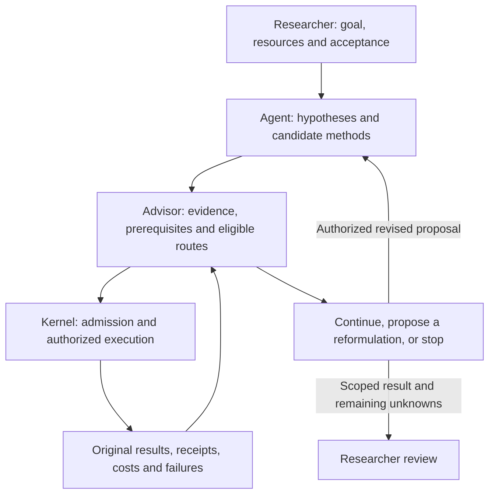

# RDS: vision, research decisions and evidence

[简体中文](rds-purpose.zh-CN.md) · [Homepage](../README.md) · [Research workflow](research-workflow.md) · [Roadmap](roadmap.md)

Our fundamental purpose is to help AI better assist people in scientific research. Research Direction Selector (RDS) is the implementation form we have chosen: connecting research goals, evidence, decisions and execution so researchers and AI can clarify questions, compare hypotheses, test ideas and learn from results. More useful assistance, better decisions and less repeated work are intended benefits to evaluate; execution records and software tests establish narrower properties.

## What the name commits us to

| Word | Design responsibility | Question a researcher should be able to inspect |
| --- | --- | --- |
| **Research** | Preserve the original question, competing explanations and the conditions for accepting a result. | Does this action address the scientific question, or just complete a convenient subtask? |
| **Direction** | Allow hypotheses, methods, representations and dependency structures to be proposed and revised after evidence. | If this approach fails, what assumption should change, and what observation would distinguish the alternative? |
| **Selector** | Connect declared evidence, prerequisites and authorized resources to an executable next action or an unresolved blocker. | Why this step, what can it establish, and what result would change the decision? |

Selection is scoped to the evidence and candidates supplied to the workflow. Omitted alternatives remain unassessed. A chosen route is not a proof of optimal scientific value, and an exhausted route set is not a proof that the research goal is impossible.

## Researcher, AI and program collaborate

The researcher sets the goal, resource limits and acceptance conditions. Agents contribute hypotheses, domain reasoning, experiment code and interpretations. RDS connects these proposals to recorded evidence, applicable admission checks, execution and recovery. Domain tools and evaluators supply the observations and checks the question requires.

The five software responsibilities remain **Skill, execution and acceptance kernel, research state and memory, Advisor, and RSI**. Their detailed contracts belong in the [workflow](research-workflow.md). The ledger preserves continuity; Advisor consumes that state for the next decision. RSI evaluates proposed changes to RDS's tools or policies, separately from progress on the researcher's task.

Use the optional [Obelisk history bridge](../references/obelisk.md) for exact past-session details, and [project preferences](../references/optional-preferences.md) for decisions such as reusing compatible controls or when additional seeds are justified. These resources do not expand execution authority.

## Current entry points and their limits

These are documented interfaces in the development checkout. Check the installed revision and each guide before use; this table does not promise that every interface is packaged in an older release.

| Need | Entry point | What it does not establish |
| --- | --- | --- |
| Discuss evidence and design the next comparison | [Skill and quick start](quickstart.md) | Agent advice alone does not verify a hypothesis or authorize new resources. |
| Select from a policy-bound project using retained results | [Owned Advisor](program-owned-advisor.md), `advise`, `project advance` | Selection uses declared routes and predicates; it is not general scientific judgment. |
| Test another formulation when the decomposition fails | [Problem structure](problem-structure.md), `structure` | Proposed concepts and relations remain unconfirmed; public scripted cases are engineering fixtures. |
| Continue execution or request a scoped method repair | [Research drive](autonomy-loop.md), `project drive` | The controller preserves limits; a completed pass does not establish autonomous discovery. |
| Retain expensive work across interruptions | [Command wrapper](agent-entry.md#wrap-a-command), execution receipts and recovery | RDS does not control commands launched outside its supported entry points. |
| Check a mathematical or domain-specific statement | [Formal verification](formal-verification.md), [domain confirmation](domain-confirmation.md) | The report applies to the checked statement and assumptions; it does not establish the broader scientific mechanism. |

The [homepage measurements](../README.md#measured-not-promised) report task-specific agent comparisons, including negative results. They do not establish general direction-selection gains, a complete autonomous discovery loop or RSI improvement.

## The longer view

The first goal is useful support across the research workflow: clarify the question, select a discriminating test, check its design, execute it, interpret the result and carry the evidence into the next decision. The researcher retains control over the goal, material resource changes and scientific acceptance.

The longer-term question is how AI can provide deeper, sustained assistance in more research domains: propose a new approach after failure, check it with an independent evaluator and resume without losing the researcher's goal or costs. Bounded automation and problem reformulation are means to support that collaboration. Their value should be judged by usefulness to the researcher and the resulting evidence. There is no promised completion date or claim that these benefits have already been demonstrated.

The adopted L0–L5 taxonomy and the difference between component automation and discovery autonomy belong in [research autonomy](research-autonomy.md). It is an external scope framework, not a quality score or safety certification. Tool-policy improvement through RSI is a separate axis.

## What would demonstrate progress

Evaluate on unused research tasks with the same model, tools, information access and total budget. For studies of human assistance, also state the researcher's role, expertise and effort, and assess whether the person can understand, verify and correct the advice. Agent-only trials and studies involving researchers support different claims. Publish failures and negative outcomes alongside successful trajectories. The [benchmark protocol](../benchmark/README.md), [problem-structure evaluation](problem-structure-evaluation.md) and [RSI evidence requirements](../references/rsi-evidence.md) define their respective scopes.

| Claim | Evidence needed |
| --- | --- |
| Better next-step decisions | Independent task acceptance and decision errors across matched research trajectories, including failed attempts and evaluation cost. |
| Useful reformulation after failure | Original failed approach, competing revised formulations, a distinguishing test, its original result and the resulting change of action. |
| Less repeated work or human correction | Attempt and receipt history, duplicate work, time to leave a dead end, and recorded human interventions. |
| Reliable continuation | Interrupted and resumed trajectories preserving completed work, spent/reserved resources, data exposure and unresolved failures. |
| Improved RDS policy | A candidate and baseline evaluated on unused cases at matched total cost, with adoption and rollback evidence. |

A process can exit successfully while the goal remains unmet. A metric can improve while mechanism support remains `UNKNOWN`. A certificate checks a particular mathematical statement. Preserve those distinctions in every result and every public claim.
