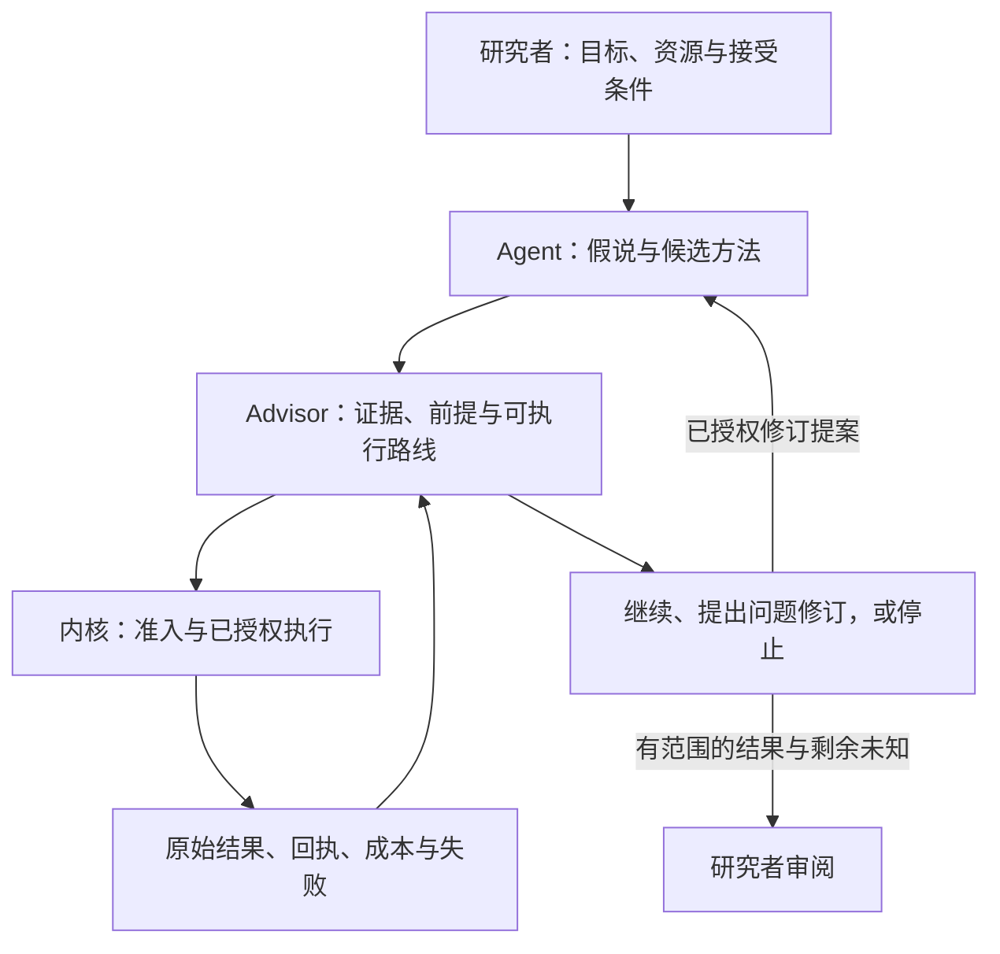

# RDS：愿景、科研决定与证据

[English](rds-purpose.md) · [项目首页](../README.zh-CN.md) · [科研工作流](research-workflow.zh-CN.md) · [路线图](roadmap.md)

我们的根本目的是让 AI 更好地辅助人进行科研。Research Direction Selector（RDS）是我们选择的实现形式：连接科研目标、证据、决策与执行，让研究者与 AI 一起澄清问题、比较假说、检验想法并从结果中积累经验。辅助更有用、决定更好、重复工作更少，是需要评估的预期收益；执行记录与软件测试只能支持各自范围内的性质。

## 名字要求我们做到什么

| 名称 | 设计职责 | 研究者应能审阅的问题 |
| --- | --- | --- |
| **Research** | 保留原始问题、竞争解释和结果接受条件。 | 这项行动回答科学问题，还是只完成一个方便的子任务？ |
| **Direction** | 允许依据证据提出、修订假说、方法、表示方式和依赖结构。 | 当前路线失败后，应改变哪个假设？什么观测能区分替代方案？ |
| **Selector** | 将声明的证据、前提和已授权资源连接到下一可执行行动，或未解决的阻塞。 | 为什么选择这一步？它能说明什么？什么结果会改变决定？ |

选择只覆盖交给工作流的证据与候选。遗漏的替代方案仍未评估。选中一条路线不能证明科学价值最优，候选耗尽也不能证明研究目标不可能实现。

## 研究者、AI 与程序共同协作

研究者确定目标、资源上限和接受条件；Agent 提供假说、领域推理、实验代码与解读；RDS 将提案连接到已有证据、适用的准入检查、执行与恢复。领域工具和评价器提供科学问题所需的观测与检查。

五个软件职责仍为 **Skill、执行与验收内核、研究状态与记忆、Advisor、RSI**，详细契约见[工作流](research-workflow.zh-CN.md)。账本保留连续性，Advisor 消费这些状态以决定下一步。RSI 评估 RDS 工具或策略的修订，与研究者原任务的进展分别判断。

需要精确历史时使用可选的 [Obelisk 桥接](../references/obelisk.md)；兼容对照复用、何时有依据追加 seed 等选择见[项目偏好](../references/optional-preferences.md)。这些资源不扩大执行授权。

## 当前入口及其范围

以下是开发 checkout 中有文档说明的接口。使用前核对安装版本和对应指南；本表不承诺旧发布包包含全部接口。

| 需要什么 | 使用入口 | 不能由此证明什么 |
| --- | --- | --- |
| 讨论证据，设计下一次比较 | [Skill 与快速入门](quickstart.zh-CN.md) | Agent 建议本身不能验证假说或授权新增资源。 |
| 根据已有结果，在策略绑定的项目中选路 | [程序持有的 Advisor](program-owned-advisor.md)、`advise`、`project advance` | 选择依赖已声明路线与谓词，不能代表通用科学判断。 |
| 原分解失败后检验另一种问题表述 | [问题结构](problem-structure.md)、`structure` | 新概念与关系提案仍未确认；公开脚本案例是工程夹具。 |
| 连续执行或请求有范围的方法修复 | [研究推进](autonomy-loop.md)、`project drive` | 控制器保留资源边界；一轮执行完成不能证明自主发现。 |
| 中断后保留昂贵工作 | [命令封装](agent-entry.md#wrap-a-command)、执行回执与恢复 | RDS 无法管住通过其支持入口以外启动的命令。 |
| 检查数学或领域命题 | [形式化验证](formal-verification.zh-CN.md)、[领域确认](domain-confirmation.md) | 报告适用于受检命题与假设，不能证明更广泛的科学机制。 |

[首页测量](../README.zh-CN.md#已测到的而非承诺的)报告特定任务上的 Agent 对照，包括负面结果。它们不能证明通用选路收益、完整自主发现闭环或 RSI 改进。

## 更长远的方向

首先让整个科研工作流都有实用支持：澄清问题、选择有区分力的检验、检查设计、执行、解读结果，并将证据用于下一决定。研究者保留目标、实质资源变更与科学接受的决定权。

长期要研究 AI 如何在更多科研领域提供更深入、持续的帮助：失败后提出新方法，通过独立评价器检查，中断后恢复且不丢研究者的目标或成本。有界自动化与问题修订是支撑协作的手段，价值应由它对研究者是否有用、产生了什么证据来判断。没有完成日期承诺，也不宣称这些收益已经获证。

采用的 L0–L5 框架，以及组件自动化与发现自主性的区别，见[科研自主程度](research-autonomy.md)。这是外部范围框架，不是质量评分或安全认证。RSI 的工具策略改进属于另一条轴线。

## 什么证据才说明取得进展

在未使用研究任务上比较，保持模型、工具、信息权限与总预算一致。评估对人的辅助时，还应声明研究者的角色、领域经验与投入，检查人能否理解、复核和纠正建议。纯 Agent 试验与有人参与的评估支持不同声明。公开成功轨迹，也公开失败和负面结果。[基准协议](../benchmark/README.md)、[问题结构评估](problem-structure-evaluation.md)与 [RSI 证据要求](../references/rsi-evidence.md)分别定义对应范围。

| 声明 | 所需证据 |
| --- | --- |
| 下一步决定更好 | 同条件研究轨迹的独立任务验收与决策错误，计入失败尝试和评估成本。 |
| 失败后的问题修订有用 | 原失败路线、竞争修订方案、有区分力的检验、原始结果，以及随后改变的行动。 |
| 重复工作或人工纠正减少 | 尝试与回执历史、重复工作、离开死路的时间，以及人工介入记录。 |
| 接续可靠 | 中断与恢复轨迹保留已完成工作、已花费／预留资源、数据暴露和未解决故障。 |
| RDS 策略有所改善 | 在未使用案例和同总成本下比较候选与基线，并保留采用、回退证据。 |

进程成功退出时，目标仍可能未满足；指标提高时，机制支持仍可能为 `UNKNOWN`；证书只检查特定数学命题。每项结果与对外声明都要保留这些区别。
