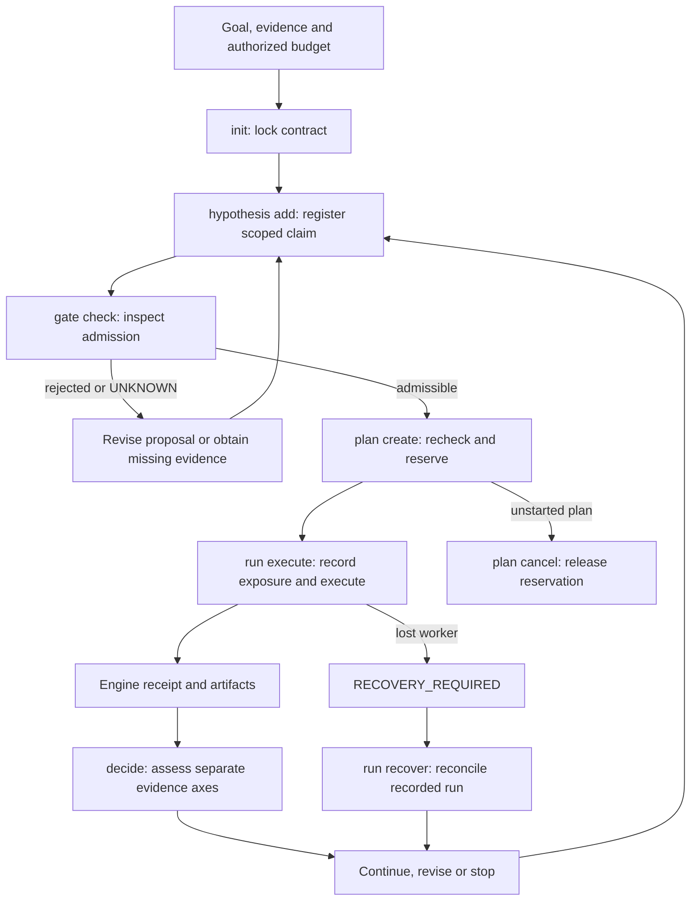

# Research workflow: responsibilities, execution and evidence

[简体中文](research-workflow.zh-CN.md) · [Documentation](README.md) · [Formal verification](formal-verification.md)

RDS is our chosen form for helping AI better assist people in scientific research. It connects the researcher's question to candidate directions, a testable next step and evidence for continuation or reformulation. The [vision and acceptance criteria](rds-purpose.md) explain the intended benefit; this guide describes the responsibilities and evidence contracts that support it. The researcher sets the goal and resources; observed evidence determines the strength of a claim. Keep three things separate: components describe software responsibilities; the adopted L0–L5 framework describes scientific-discovery automation; the CLI records execution states. Each claim has its own evidence assessment.

## Five components and their responsibilities

The three foundational components and two enhancement components describe responsibilities in one loop. Advisor connects evidence to the next decision; its central role does not imply that every connection is autonomous or that scientific outcomes have improved.

| Group | Component | Responsibility |
| --- | --- | --- |
| Foundation | Research protocol Skill | Guide intent, evidence gathering, experiment design, result interpretation and resumption in collaboration with the researcher. |
| Foundation | Execution and acceptance kernel | Bind plans and resources, check applicable constraints, execute supported experiments, and record artifacts, receipts and recovery state. |
| Foundation | Research state and memory | Preserve goals, configurations, results, failure conditions and decision reasons through project records in `.rds`, the judgment graph and Obelisk history retrieval. |
| Enhancement | Advisor | Connect the original goal, evidence, constraints and available candidate routes to a next executable action or an explicit blocker; retain the decision's reasons and unknowns. |
| Enhancement | RSI | Propose scoped revisions to rules and work policies, evaluate them, and retain or roll back changes according to evidence. |

Budget checks, probes, log handling and applicable mathematical checks belong to the execution and acceptance kernel. The judgment graph and historical sources support research state and memory. Lean-compatible cooperation concerns suitable mathematical subtasks; it does not replace experimental evidence for the broader research claim. Autonomy levels describe discovery automation across these components and are not additional components.

## Advisor: current implementation and direction

Advisor's intended process starts with real evidence and follows the judgment graph and scoped rules to generate or combine candidates. Each candidate should identify competing explanations, a discriminating observation, and how positive or negative results would change the next decision. Screen these candidates for authorized total cost after establishing their decision value; preserve their derivation and evidence sources.

The current implementation combines diagnostic hints and scoped rule retrieval with bounded graph search over source-labelled facts and explicit executable bindings. It follows `prerequisite_for` dependencies, preserves unknown conditions as evidence queries, records competing explanations and result-dependent next decisions, and compares costs only when their units are comparable. The rules and candidate bindings are authored; general automatic discovery and combination of research ideas remain development directions. Rule matching does not establish a causal diagnosis. Claims about Advisor's scientific success rate, research quality or cost savings require independent research trajectories; the [component benchmark](advisor-benchmark.md) measures narrower contract checks. RSI likewise produces candidate policy changes, whose improvement needs the independent RSI evaluation described below.

## Program-owned result and decision loop

In a project initialized with `advisor_policy`, the researcher freezes the goal, allowed commands, candidate routes, result readers and resources. Skill guides that preparation; the kernel and state store enforce and preserve the declared bindings. Advisor reviews program-derived facts and resources, and `project advance` selects and executes at most one eligible route. The receipt and declared outputs update the current evidence graph, which feeds the next Advisor decision automatically. [Run the CPU example](program-owned-advisor.md#run-the-public-cpu-example) to inspect this supported entry.

The loop can continue on an eligible route, stop when the declared goal is met, or retain a blocker for evidence gathering or reformulation. A tested predicate `FALSE` is not execution failure or automatic scientific refutation; missing or inconclusive scientific support remains `UNKNOWN`. No eligible route is not proof of the goal. New hypotheses, application premises and independent scientific validation still require agents and domain-specific tools. Expanding the frozen candidate space needs a reviewed new policy, not a caller-written success summary.

Projects without `advisor_policy` keep their existing caller-directed behavior; their receipts alone do not imply this automatic collection and selection loop. The bounded reference CLI below is a different supported execution path. Neither path is a host-wide command sandbox, and regression or replay success does not establish better scientific decisions or prospective RSI gain.

## Adopted scientific-discovery autonomy levels

RDS adopts the framework formally published by Kramer et al. (2026), retaining the original six levels, L0–L5. The definitions were checked in author preprint v2, §5 / Table 2; the journal table is numbered Table 5. This overview focuses on L1–L4; it does not create a four-level RDS scale. The [autonomy guide](research-autonomy.md) provides original names, source links and concise scope summaries.

| Level | Scope |
| --- | --- |
| L1 | Computer assistance in an aspect of science. |
| L2 | One significant discovery component is fully automated. |
| L3 | A complete discovery cycle is automated in a limited domain. |
| L4 | Discovery cycles span multiple domains, with limited autonomous goal setting. |

These levels are not software components, database states, quality scores, safety certification or SAE compliance. They do not define who takes over after a fault. RDS's contracts separately constrain actions, data and evaluators, environments, budgets, evidence gates, stopping, artifact preservation and recovery. Existing authorization and caps govern actions without a new blanket approval step.

Current public `main` provides a human-facing protocol, a bounded scalar reference runner, checked mathematical interfaces from [PR #2](https://github.com/kongtou20070406/research-direction-selector/pull/2), and Advisor graph search and a read-only dashboard from [PR #3](https://github.com/kongtou20070406/research-direction-selector/pull/3). Automatic reference computations and explicitly bound candidate search provide scoped L2 functionality; this does not grade RDS as a general research system. It has not demonstrated a complete scientific L3 or L4 loop or an end-to-end GPU research service. Existing L3 runner identifiers and the former L4-RSI label are historical engineering names and do not map to the adopted levels.

## One experiment in the reference CLI

The runnable source files are in [examples/reference-run](../examples/reference-run/contract.json). Follow the [bounded reference workflow](../references/l3-state-machine.md) for this entry; the [homepage](../README.md#deterministic-execution--acceptance-kernel) shows the external-project runner instead.

| Operation | Meaning and boundary |
| --- | --- |
| `init --contract` | Locks the claim, evaluator, baseline, split identities and budget. Use a new root for a different contract. |
| `hypothesis add --spec` | Registers purpose, competing explanation and falsification conditions. Declare mathematical obligations explicitly when applicable. |
| `gate check --plan` | Checks a proposal without reserving resources. A pass is advisory; the later reservation rechecks mutable constraints. |
| `plan create --spec` | Atomically reserves an allocation after admission. Exploration cannot consume the confirmation floor. |
| `run execute --id` | Uses the bound source and data; records data access, artifacts and an engine-generated receipt. Starting consumes the allocation even if the run fails. |
| `decide --run` | Reads the receipt and assesses task gain and mechanism evidence. It does not accept handwritten metric gains or success flags. |
| `plan cancel --id` / `run recover --id` | Cancels an unstarted reservation or reconciles an interrupted run. A lost worker is marked `RECOVERY_REQUIRED`; spent budget is retained. Recovery does not resume execution or silently start a replacement experiment. |
| `status` | Inspects recorded operational state. It does not establish scientific confirmation. |

Place global `--root` before the subcommand. Each reference allocation is at most 60 seconds. This ledger measures allocated worker runtime; setup, evaluation overhead and external GPU jobs need their own accounting. The reference kernel is not a general training scheduler.

## Evidence axes and decision conditions

| Recorded axis | What it can establish | What it cannot establish by itself |
| --- | --- | --- |
| Verifier `status` and `assurance` | Whether a declared property was checked, and by what method. | Utility, causal attribution or independent scientific confirmation. |
| `run_status` | Whether execution succeeded, failed, timed out or requires recovery. | Scientific support or refutation. |
| `assessment.task_gain` | Development evidence; or the frozen finite comparison and useful-gain threshold on eligible confirmation data. | Population generalization or a better research-search policy. |
| `assessment.mechanism` | The recorded intervention and falsifier evidence within the supported model. | Mechanism support merely because scores rose. Ordinary runs remain `UNTESTED`. |

Use development data for choices. Freeze selection before independent confirmation, record prior exposure, and keep exploratory signals separate from confirmation. Previously viewed or selection-used data cannot become independent by changing its label. Unreported off-system access remains outside the kernel's knowledge.

For declared mathematical claims, `FAIL` and `UNKNOWN` both block formal admission. A successful mathematical check does not bypass budget, source-binding or data-use constraints. The verifier guide explains the distinction between admission certificates and observed execution.

## Revising the experiment, and evaluating RSI independently

Prefer existing evidence and matched same-seed comparisons. Do not routinely add multi-seed campaigns. Recommend additional seeds only after observed seed instability threatens the current conclusion and the decision value justifies the authorized cost; state the uncertainty when existing evidence is insufficient.

A failed or timed-out run first calls for execution diagnosis. A valid negative scientific result can instead narrow the hypothesis or change the route. A task gain with an untested mechanism supports only the gain statement at the corresponding evidence level.

RSI is independent of the adopted autonomy levels: a supervised workflow can evaluate policy changes, and greater automation need not improve the policy. Keep policy updates as reviewable candidates. Compare old and revised policies prospectively on unused research cases, with the same total budget including unsuccessful trials, diagnosis, verification and evaluation. Record versions, information exposure, stopping rules and negative results. Reusing development cases or showing only the best model does not establish policy improvement.

Obelisk supplies relevant historical source records; `.rds/state.sqlite3` supplies operational contracts and receipts. Retrieved text grants no new authorization, and the execution ledger is not a second conversational memory store.
