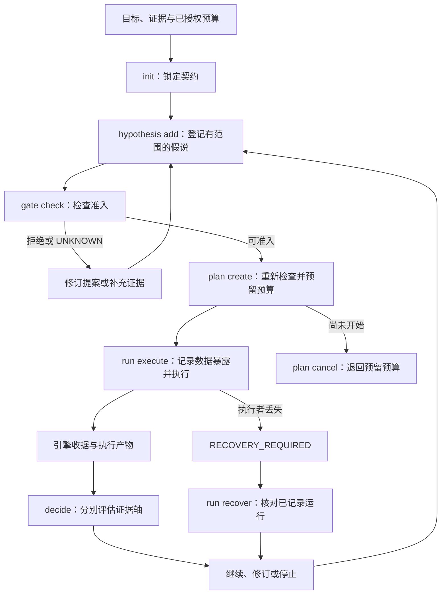

# 科研工作流：职责、执行与证据

[English](research-workflow.md) · [文档导航](README.zh-CN.md) · [形式化验证](formal-verification.zh-CN.md)

RDS 是我们为“让 AI 更好地辅助人进行科研”选择的形式，将研究者的问题连接到候选方向、可检验的下一步，以及继续或修订问题的证据。[愿景与验收标准](rds-purpose.zh-CN.md)说明希望获得的收益；本指南说明支撑它的职责与证据契约。研究者确定目标与资源，实际证据决定声明能有多强。三件事分别说明：组件描述软件职责，采用的 L0–L5 框架描述科学发现自动化程度，CLI 记录执行状态；每个命题有自己的证据评估。

## 五个组件及其职责

三个基础组件和两个增强组件说明同一闭环中的职责。Advisor 将证据连接到下一决定；它处于决策中心，不代表每个环节都已自主执行或科学收益已经提高。

| 分组 | 组件 | 职责 |
| --- | --- | --- |
| 基础 | 科研规程 Skill | 与研究者协作，指导意图理解、证据收集、实验设计、结果解释和任务接续。 |
| 基础 | 执行与验收内核 | 绑定计划与资源，检查适用约束，执行所支持的实验，并记录产物、收据与恢复状态。 |
| 基础 | 研究状态与记忆 | 通过 `.rds` 项目记录、判断图和 Obelisk 历史检索，保留目标、配置、结果、失败条件与决策依据。 |
| 增强 | Advisor | 将原始目标、证据、约束和已有候选路线连接到下一可执行行动或明确阻塞，保留决策理由与未知项。 |
| 增强 | RSI | 提出有范围的规则与工作策略修订，进行评估，再依据证据保留或回滚。 |

预算检查、探针、日志处理和适用的数学检查属于执行与验收内核；判断图与历史来源支撑研究状态与记忆。Lean 兼容协作针对适合的数学子任务，不替代更广研究声明所需的实验证据。自主等级描述跨组件的科学发现自动化程度，不是额外组件。

## Advisor：现有实现与发展方向

Advisor 的目标从真实证据出发，沿判断图和有范围的规则生成或组合候选。每个候选应说明竞争解释、可区分它们的观测，以及正负结果分别怎样改变下一次决策。先判断候选的决策价值，再按已授权总成本筛选；保留推导过程与证据来源。

当前实现将诊断线索、有范围的规则检索与有界图搜索接通，输入为带来源标签的事实和显式可执行绑定。它沿 `prerequisite_for` 依赖推导，把未知条件保留为证据查询，记录竞争解释和不同结果对应的下一步决定，仅在成本单位可比时比较费用。规则与候选绑定由人编写；一般性的研究想法自动发现与组合仍是发展方向。规则匹配不构成因果诊断。Advisor 的科研成功率、研究质量或费用节省需要独立研究轨迹支持；[组件基准](advisor-benchmark.md) 测量的是更窄的契约检查。RSI 同样先产生候选策略变更，其改善需要下面所述的独立 RSI 评估。

## 程序持有的结果与决策闭环

具有 `advisor_policy` 的项目在初始化时，由研究者固定目标、允许命令、候选路线、结果读取规则与资源。Skill 指导准备，内核和状态存储执行并保留这些绑定。Advisor 审查程序派生的事实与资源，`project advance` 至多选择并执行一条可用路线。回执与已声明输出更新当前证据图，再自动进入下一次 Advisor 决策。[公开 CPU 示例](program-owned-advisor.md#run-the-public-cpu-example)提供了该入口。

闭环可以沿可用路线继续、在声明目标成立时停止，或保留阻塞以补证据或提出转向。被检查的谓词为 `FALSE` 不等于执行失败，也不自动反驳科学机制；缺失或不确定的科学支持保持 `UNKNOWN`。没有可执行路线不等于目标获证。新假说、应用前提和独立科学验证仍需 Agent 与领域工具。扩展冻结候选空间需要审查新策略，不能用调用方编写的成功摘要替代。

没有 `advisor_policy` 的项目保留原有调用方引导方式；仅有回执不代表已经启用自动采集与选路闭环。下面的有限参考 CLI 是另一条受支持的执行路径。两者都不是宿主级命令沙箱；回归或历史回放成功不证明更好的科学决策或前瞻 RSI 收益。

## 采用的科学发现自主分级

RDS 采用 Kramer 等（2026）正式刊载的框架，保留原来的 L0–L5 六级。定义按作者预印本 v2 的 §5／表 2 核对，期刊版表号为表 5。本页重点说明 L1–L4，不另造 RDS 四级。[自主程度说明](research-autonomy.md)提供原名、来源链接与简要释义。

| 层级 | 范围 |
| --- | --- |
| L1 | 科研某一方面得到计算机辅助。 |
| L2 | 一个重要科学发现环节完全自动化。 |
| L3 | 限定领域内完整科学发现循环自动化。 |
| L4 | 跨多个科研领域完成发现闭环，并能有限自主设置目标。 |

这些等级不是软件组件、数据库状态、质量评分、安全认证或 SAE 合规，也不定义故障后由谁接管。RDS 契约另行限定行动、数据与评估器、环境、预算、证据门禁、停止、产物保存和恢复。行动遵守已有授权与上限，不新增逐轮强制审批。

公开 `main` 当前提供面向人的规程、受限标量参考运行器、[PR #2](https://github.com/kongtou20070406/research-direction-selector/pull/2) 引入的数学检查接口，以及 [PR #3](https://github.com/kongtou20070406/research-direction-selector/pull/3) 引入的 Advisor 图搜索和只读工作台。自动参考计算与显式绑定候选搜索具有局部 L2 功能，不为 RDS 作通用科研等级判断；尚未证明完整科学 L3、L4 闭环或端到端 GPU 科研服务。运行器现有 L3 标识与原先 L4-RSI 标签是历史工程命名，不能映射为采用框架的等级。

## 参考 CLI 的单次实验流程

可运行源文件见 [examples/reference-run](../examples/reference-run/contract.json)，该入口遵循[有限参考执行流程](../references/l3-state-machine.md)；[首页](../README.zh-CN.md#确定性的执行与验收内核)展示的是外部项目执行器。

| 操作 | 含义与边界 |
| --- | --- |
| `init --contract` | 锁定命题、评估器、基线、数据划分身份和预算；不同契约使用新的 root。 |
| `hypothesis add --spec` | 登记用途、竞争解释和证伪条件；存在数学义务时须明确声明。 |
| `gate check --plan` | 检查提案但不预留资源。通过只是建议性的结果；后续预留会重新检查可变约束。 |
| `plan create --spec` | 准入后以事务原子预留资源；探索不能花掉确认预算底线。 |
| `run execute --id` | 使用已绑定代码和数据，记录数据访问、产物与引擎收据；开始执行即计入分配额度，失败也计入。 |
| `decide --run` | 读取收据，评估任务收益与机制证据；不接受手写指标收益或成功标志。 |
| `plan cancel --id` / `run recover --id` | 取消尚未开始的预留，或核对中断运行；失联执行者被标为 `RECOVERY_REQUIRED`，已消耗预算保留。恢复不会续跑执行或静默启动替代实验。 |
| `status` | 查看已记录的运行状态；不产生科学确认。 |

全局 `--root` 放在子命令之前。参考运行每次分配不超过 60 秒；账本计量分配给执行者的运行时间。准备、评估开销和外部 GPU 作业需要另外核算，参考内核不是通用训练调度器。

## 证据轴与决策条件

| 记录轴 | 可以说明什么 | 单独不能说明什么 |
| --- | --- | --- |
| 验证器 `status` 与 `assurance` | 声明性质是否经过检查，以及采用哪种检查方式。 | 实用收益、因果归因或独立科学确认。 |
| `run_status` | 执行成功、失败、超时或需要恢复。 | 科学支持或反驳。 |
| `assessment.task_gain` | 开发集证据；或在合格确认数据上的冻结有限比较和最小有用收益条件。 | 总体泛化或研究搜索策略改善。 |
| `assessment.mechanism` | 在支持模型内记录的干预与证伪证据。 | 分数上升本身不能支持机制；普通运行仍为 `UNTESTED`。 |

用开发数据做选择，独立确认前冻结选择，并记录已有暴露。探索信号与确认分别报告；看过或用于选择的数据不能通过改名变成独立数据。内核无法发现未报告的系统外访问。

显式数学声明的 `FAIL` 和 `UNKNOWN` 都阻止形式准入。数学检查成功不能绕过预算、代码绑定和数据使用约束。准入证书与执行观测的区别见形式化验证指南。

## 修订实验，以及独立评估 RSI

优先使用已有证据和同 seed 的公平对照，不常规安排多 seed 实验。只有已经观察到 seed 不稳定、可能影响当前结论，且决策价值足以支撑授权成本时，才建议追加；现有证据不足时直接注明不确定性。

运行失败或超时应先诊断执行问题；有效的科学负结果则可能收窄假说或改变路线。任务收益成立但机制未测，只能在对应证据层级支持收益表述。

RSI 与采用的自主等级独立：人类监督的流程也能评估策略变更，自动化程度增加不一定改善策略。策略更新先保留为可审阅候选。在未用过的研究案例上，前瞻比较旧策略和新策略；相同总预算必须包含失败尝试、诊断、验证与评估。记录版本、信息暴露、停止规则和负结果。复用开发案例或只展示最佳模型，不能证明策略改进。

Obelisk 提供相关历史原始记录，`.rds/state.sqlite3` 提供运行契约和收据。检索到的文字不产生新授权，执行账本也不是另一个会话记忆库。
